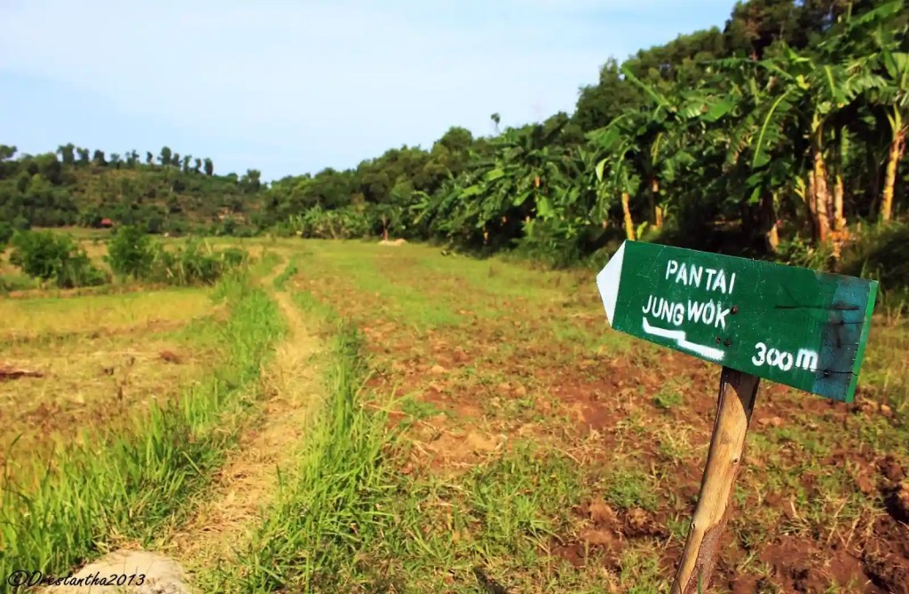
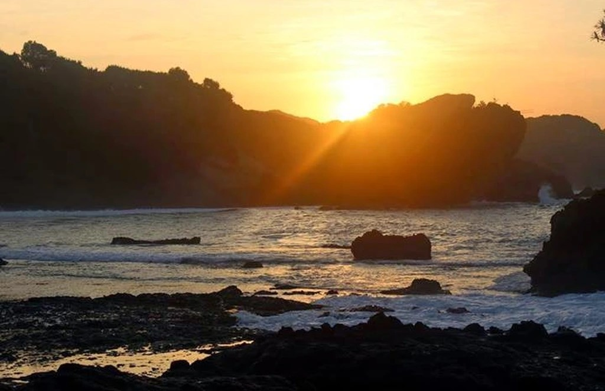
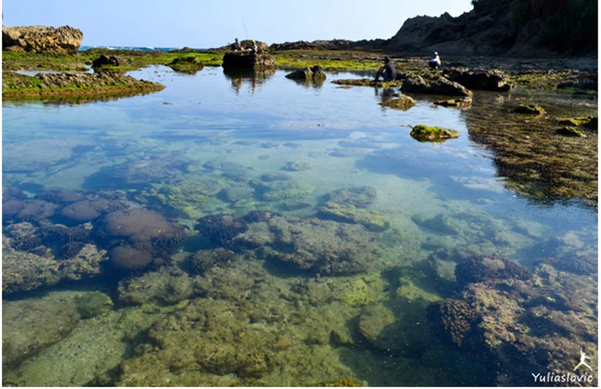
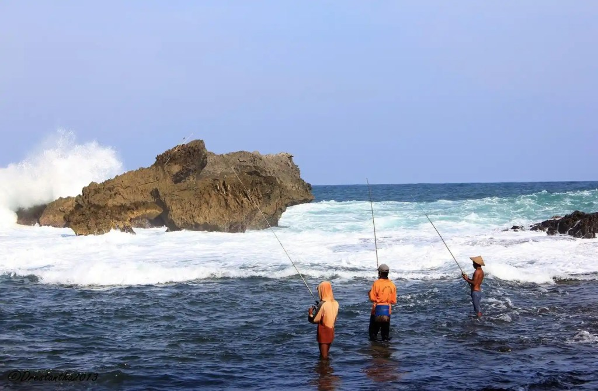

Pantai Jungwok adalah salah satu pantai indah yang ada di Gunung Kidul, Yogyakarta. Keindahannya menjadi salah satu daya tarik bagi wisatawan, baik lokal maupun mancanegara.

Pantai ini adalah salah satu pantai yang wajib kamu kunjungi ketika kamu berlibur ke Yogyakarta. Pemandangan dan suasana di Pantai Jungwok akan membuatmu santai, tenang, dan sejenak melupakan kesibukan di tempatmu tinggal.

Pada tulisan ini, kita akan mengulas Pantai Jungwok Jogja. Mulai dari alamat, lokasi, rute, harga tiket masuk dan jam operasional, fasilitas, serta foto-foto yang akan memberikan gambaran kepadamu tentang pantai yang namanya mirip artis K-Pop, _hahaha_.

Lokasi, Alamat, dan Rute Pantai Jungwok
---------------------------------------

**Pantai Jungwok di Mana?**

Pantai ini terletak di Desa Jepitu, Girisubo, Gunung Kidul, Yogyakarta.

**Apakah Pantai Jungwok Buka?**

Pantai Jungwok buka setiap hari, Senin sampai Minggu selama 24 jam. Sejauh ini, tidak ada jam operasional khusus yang ditetapkan pengelola. Jadi, kamu bisa kapan saja mengunjungi Pantai Jungwok.

Akses jalan menuju Pantai Jungwok terbilang nyaman nan ramai lancar. Dari Kota Yogyakarta, kamu bisa menempuhnya menggunakan kendaraan pribadi seperti motor ataupun mobil. Dengan memakan waktu kurang lebih dua jam dari Kota Yogyakarta, kamu bisa sampai di sini (kalau tidak macet, ya).

Sejauh mata memandang, tidak ada transportasi umum untuk menuju pantai ini. Oiya, karena jalannya masih terbilang cukup sempit, alangkah lebih baik jika datang bersama rombongan menggunakan bus pariwisata ukuran tanggung.

Terdapat dua rute yang bisa kamu tempuh untuk menuju Pantai Jungwok, rute Jalan Wonosari dan rute Jalan Panggang. Kalau kamu mengambil rute Jalan Wonosari, ikuti jalan menuju kecamatan Semanu. Dari pertigaannya, belok kanan menuju Pantai Wediombo. Sekadar informasi tambahan, Pantai Jungwok terletak dekat Wediombo. Sebelum sampai di Wediombo, kamu akan melihat papan petunjuk arah Jungwok yang berjarak sekitar 1 kilometer.

### Rute Pantai Jungwok

Untuk rute dan lokasi lebih lengkapnya, kamu bisa melihat peta yang kuambil dari Google Maps berikut ini.

Harga Tiket Masuk dan Jam Buka
------------------------------

Untuk menikmati keindahan Pantai Jungwok Gunung Kidul Yogyakarta, kamu cukup merogoh kocek 5 ribu rupiah saja untuk per orang. Untuk biaya parkirnya terilang standar, di mana 2000 rupiah per motor dan 5000 rupiah untuk mobil.

Kamu bisa mengunjungi pantai ini setiap saat. Seperti yang kutulis sebelumnya, tidak ada jam operasional khusus yang ditetapkan pihak pengolola. Jadi, kamu bisa menikmati keindahan pantai ini kapan saja. Namun, aku menyarankan agar kamu datang saat matahari masih tampak saja agar bisa menikmati keindahan sunset di Pantai Jungwok.

Fasilitas Pantai Jungwok
------------------------

Pada bab ini, kita akan membahas fasilitas yang ada di Pantai Jungwok. Tidak hanya fasilitas umum saja, tapi juga keindahan yang ditawarkan pantai ini kepada setiap pengunjungnya.

### Panorama Indah Pantai Jungwok

Sama seperti Pantai Pringjono yang ada di Kanigoro, sebenarnya lokasi Pantai Jungwok terbilang agak terpencil _alias_ jauh dari pemukiman penduduk. Meskipun letaknya masih terbilang terpencil, panorama yang ditawarkan tidak kalah indahnya dengan pantai-pantai di Gunung Kidul lainnya.

Kalau kamu berkunjung ke sini, kamu akan melihat indahnya pantai yang bentuknya seperi bulan sabit karena cekung. Keindahan ini juga "tidak terganggu" dengan banyaknya orang karena masih sepi pengunjung (mungkin karena terpencil juga, ya).

https://ksmtour.com/informasi/tempat-wisata/yogyakarta/serunya-berpetualang-pantai-jungwok.html

### _**Camping**_

Para pecinta petualang dan dunia _outdoor_, mari-mari merapat. Camping di Pantai Jungwok adalah pilihan liburan yang tepat. Selain pemandangannya yang indah, suasana sepi, tenang, nan nyaman juga menjadi faktor serunya bermalam di sekitaran Jungwok.

Sayang waktu kan kalau sudah jauh-jauh kemari hanya menghabiskan waktu sebentar? Jadi, tidak ada salahnya kalau memutuskan _camping_. Yang perlu diingat, jangan harap ada kios-kios yang menyewakan tenda seperti di Pantai Slili atau Pantai Sadranan. Warung-warung di sekitar buka saja sudah menjadi anugrah.

Kalau mau nge-_camp_ di sini, pastikan kamu dalam keadaan prima. Oiya, jangan lupa siapkan peralatan camping yang cukup mumpuni. Selain warung-warung yang tak selalu buka, jarak pantai ini dengan pemukiman cukup jauh. Jadi, harus ada persiapan yang lebih matang.

Kalau kamu nge-_camp_ di sini, tentu kamu akan menikmati indahnya _sunset_, pagi harinya _sunrise_ menjadi "sarapan" sebelum kamu beraktivitas kembali atau beres-beres untuk kembali ke rutinitas. Yang jelas, menjadi pilihan tepat kalau untuk _camping_.

### Bermain-main Air

Menjadi pilihan yang kurang tepat untuk berenang di sini. Ombak yang menerjang sangat kencang. Kalau sekadar bermain-main air di tepian, bukanlah menjadi masalah. Namun, siapkan alas kaki yang mumpuni, ya. Selain "dilapisi" dengan pasir putih yang indah, bibir pantai ini dihiasi batu karang yang cukup keras.

Di beberapa titik juga ada batu karang yang tajam atau lancip. Kalau bermain-main tanpa alas kaki, bisa-bisa bukan menikmati liburan, tapi menikmati pertunjukan _debus_, _hehehe_. Daripada mengobati, lebih baik mencegah, bukan?

http://rizkykurnia19.blogspot.com/2012/09/pantai-pantai-indah-di-gunung-kidul.html

Sedikit tips, kalau kamu ngebet banget pengen berenang-renang, kamu harus memiliki skill renang yang cukup. Minimal kamu bisa mengapung dan bergerak ke arah yang kamu tuju. Satu lagi, punya _skill_ untuk menenangkan diri.

Kalau udah gitu, tunggu saja pagi hari, biasanya ombak di pagi hari lebih tenang dan lebih bersahabat. Yang enggak bersahabat mungkin dinginnya air dan udara sekitar. Meski demikian, tetap waspada ya. Kadang ombak datang tanpa permisi.

### Spot Mancing

Gemar memancing? Pantai ini juga menyediakan spot mancing yang amat digemari warga setempat. Tak jarang, warga sekitar menyusuri bukit karang yang ada di sekitar pantai. Kalau kamu mau mancing, siapkan peralatan mancingmu sendiri. Kalau kamu beruntung, kamu bisa mancing ditemani warga setempat yang ramah-ramah.

https://byakbyak.blogspot.com/2013/06/jungwok-hidden-beach.html

Karena biasanya spot mancing ini berada di tepian tebing, pastikan kamu memperhatikan setiap langkahmu. Jangan sampai kamu salah melangkah hingga hal-hal buruk terjadi padamu. Begitu juga kalau mancing di daerah d Yang jelas, tetap selalu berhati-hati ke manapun angin membawa.

### Sungai Air Tawar

Kalau di Pantai Pringjono terdapat mata air dengan air tawar, di sini terdapat sungai air tawar. Melansir dari [iNews](https://www.inews.id/travel/destinasi/wisata-di-pantai-jungwok-gunungkidul-spot-paling-eksotis-ada-di-bukit-manjung), terdapat tiga aliran sungai air tawar yang tampak membagi pantai ini menjadi tiga bagian. Perpaduan warna air tawar dan air asin juga menjadi salah satu keunikan yang ada di pantai ini.

Gimana? Makin mantap memilih Pantai Jungwok sebagi tujuan wisata? Masih punya pertanyaan? Atau usulan ulasan suatu pantai? Tinggalkan di kolom komentar ya!

Selamat berlibur!
