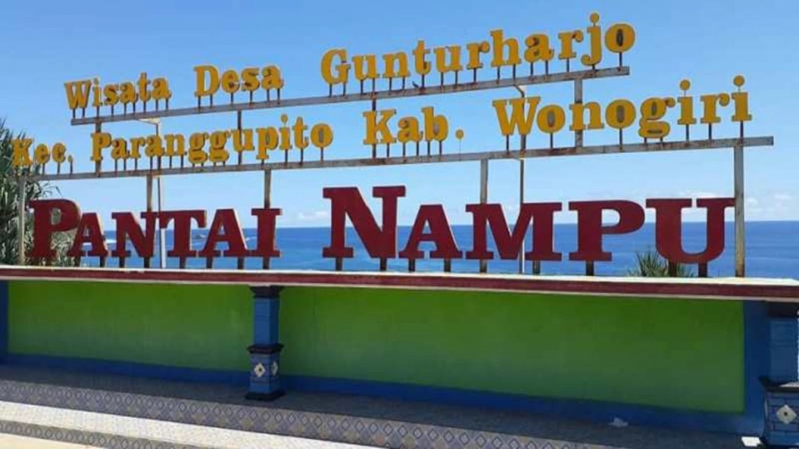
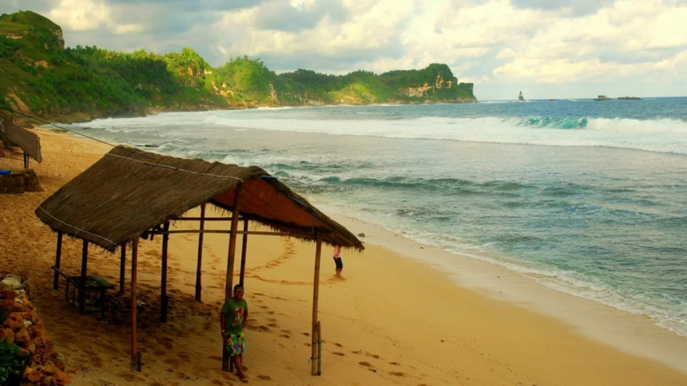
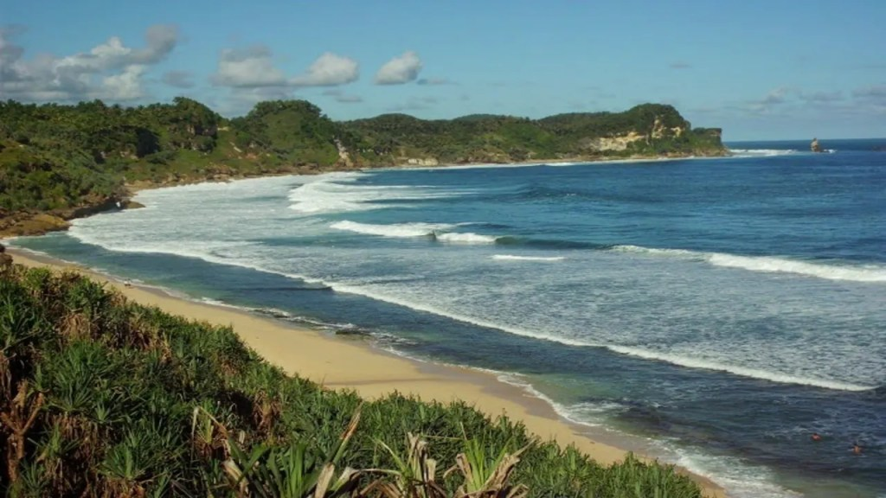
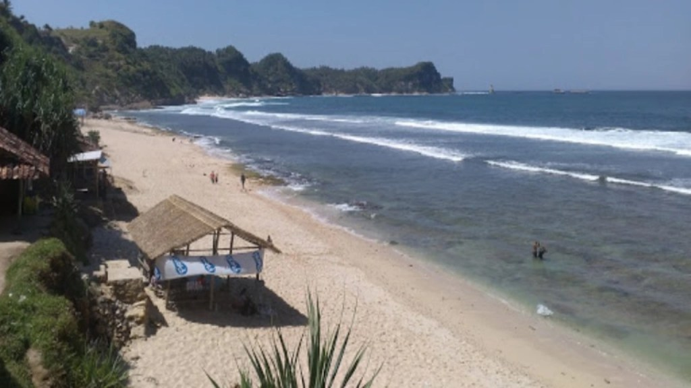

Pantai Nampu Paranggupito adalah salah satu tempat wisata yang paling populer di Wonogiri. Pasir putihnya dengan paduan terumbu karang yang indah membuat pantai ini menjadi tempat yang menarik untuk dikunjungi.

Karena keindahan alamnya, pantai ini memiliki potensi besar untuk menjadi wisata alam yang populer tidak hanya di kalangan wisatawan domestik tetapi juga di kalangan wisatawan mancanegara. Tentu bagi Anda yang berkunjung atau berencana mengunjungi Wonogiri tidak ada salahnya untuk datang ke Pantai Nampu Wonogiri.

Selain keindahan alamnya, tempat wisata pantai di Wonogiri ini sangat indah dan jarang dikunjungi wisatawan. Sebelum Anda berkunjung, tidak ada salahnya untuk menyimak beberapa informasi mengenai Pantai Nampu terlebih dahulu.

Jam Buka dan Harga Tiket Masuk Pantai Nampu
-------------------------------------------

Bicara tentang jam buka, mayoritas pantai buka 24jam atau selalu buka. Yang menjadi catatan, siapkan penerangan jika Anda berkunjung ke pantai ini saat malam hari. Sepengamatan saya, belum ada penerangan yang cukup memadai.

Untuk masuk ke kawasan Pantai Nampu, Anda tak perlu merogoh kocek terlalu dalam. Siapkan uang 5000 rupiah per orang, Anda bisa menikmati keindahan pantai ini.

Lokasi dan Rute Pantai Nampu Wonogiri
-------------------------------------

Seperti yang sudah saya singgung sebelumnya, destinasi ini merupakan salah satu objek wisata pantai yang paling terkenal di Wonogiri. Lebih tepatnya berada di Desa Gunturharjo, Kecamatan Paranggupito, Kabupaten Wonogiri.

Jarak antara Kabupaten Paranggupito dan pusat kota sekitar 15 kilometer. Karena transportasi menuju tempat wisata cukup sulit, jangan heran jika tempat ini masih cukup asing di telinga wisatawan.

Saya menyarankan gunakan kendaraan pribadi untuk berkunjung ke Pantai Nampu. Bagi Anda yang ingin mengunjungi objek wisata ini, terdapat 2 rute yang dapat bisa Anda lalui.

Rute pertama melalui Solo. Jika Anda menggunakan jalur dari Solo, Anda harus menggunakan jalur yang mengarah ke Kabupaten Wonogiri. Setelah itu, Anda dapat memilih alternatif rute untuk mencapai Kabupaten Paranggupito.

Rute kedua, menggunakan jalur dari Sukoharjo yang kurang lebih sama dengan jalur sebelumnya. Dari pusat kota Wonogiri, yang kemudian melewati Baturetno Giriwoyo, Paranggupito. Kemudian Anda bisa melanjutkan perjalanan hingga sampai di kota Gunturharjo, Dringo. Untuk rute kedua berjarak sekitar 85 kilometer dengan perkiraan waktu tempuh sekitar 2,5 jam.

Meski akses jalan menuju pantai ini masih sangat sulit, namun semua itu akan terbayar lunas sesampainya di lokasi tepi pantai. Jadi mau ambil jalan yang mana? Pastikan Anda memilih rute yang memudahkan Anda untuk sampai ke sana.

Fasilitas dan Hal Menarik di Pantai Nampu Wonogiri
--------------------------------------------------

Ciri dari Pantai Nampu nyaris sama dengan mayoritas pantai laut selatan yang lain. Perbukitan karst yang mengelilingi pantai ini jadi karakteristik khas pantai laut selatan pulau Jawa. Tidak hanya itu garis pantai di Pantai Nampu juga lumayan panjang ditambah lagi mempunyai pasir putih yang menawan.

### Akses Pantai yang Mudah

Selain menawarkan panorama alam yang sangat indah, wisata Wonogiri yang satu ini juga terbilang unik. Pantai Nampu terdiri dari 3 pantai yang dipisahkan oleh bukit karst, dari ketiga pantai ini, pantai Nampu yang menjadi kesukaan karena lokasinya yang mudah dijangkau.

Tidak hanya aksesnya sangat gampang, panorama alam yang ditawarkan di Pantai Nampu juga sangat indah. Pantai Nampu juga memiliki garis pantai yang amat panjang.

Untuk menuju ke bagian pantai yang lain, Anda mesti trekking lewat jalur setapak terlebih dahulu. Ya dengan trekking lumayan bisa sekalian berolahraga sembari menikmati indahnya pemandangan di sana.

### Terdapat Gardu Pandang

Bila Anda berjalan ke barat, Anda dapat melihat gardu pandang yang ada di atas tebing. Dari gardu pandang ini, Anda dapat menikmati indahnya pemandangan Pantai Nampu dari atas tebing. Birunya laut dan pasirnya pantai membuat fresh mata dan pikiran Anda.

### Menikmati Sunrise dan Sunset dengan Camping di Pantai Nampu

Pantai Nampu Wonogiri tidak sekadar menawarkan keelokan alam saja, di objek wisata satu ini kita pula dapat memandang indahnya sunrise serta sunset loh. Untuk menikmati bisa memandang matahari terbit kalian dapat camping di pinggir pantai. Karena tidak ada tempat penyewaan alat camping, jadi bawa perlengkapan sendiri ya.

Seiring berjalannya waktu, masyarakat mulai membuat warung-warung ataupun gazebo di tepi pantai. Sembari istirahat, menikmati pemandangan alam, Anda juga bisa membeli es kelapa muda yang dijajakan oleh masyarakat.

Penginapan di Pantai Nampu
--------------------------

Sejauh mata memandang, tidak ada penginapan di Pantai Nampu dan sekitarnya. Alternatif yang bisa Anda lakukan ya dengan _camping_. Mungkin tidak senyaman penginapan tetapi dengan bercamping, Anda akan merasakan nikmatnya menyatu dengan alam.

Bonusnya seperti yang telah saya tulis tadi, Anda dapat menikmati sunset dan sunrise dari tempat mendirikan camp Anda.