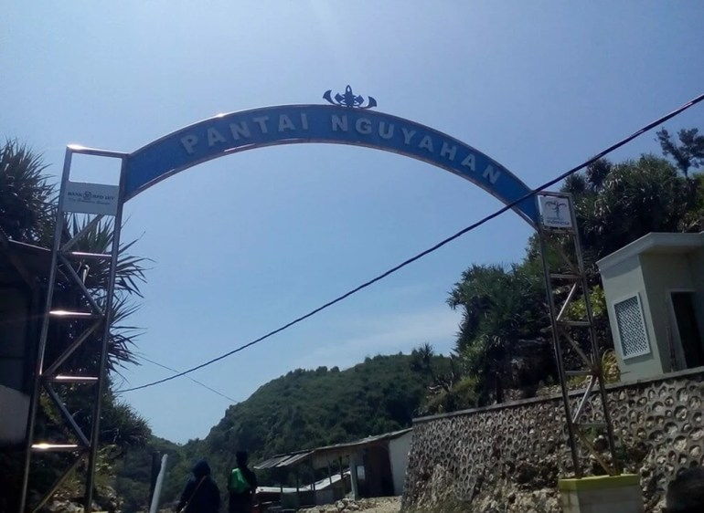
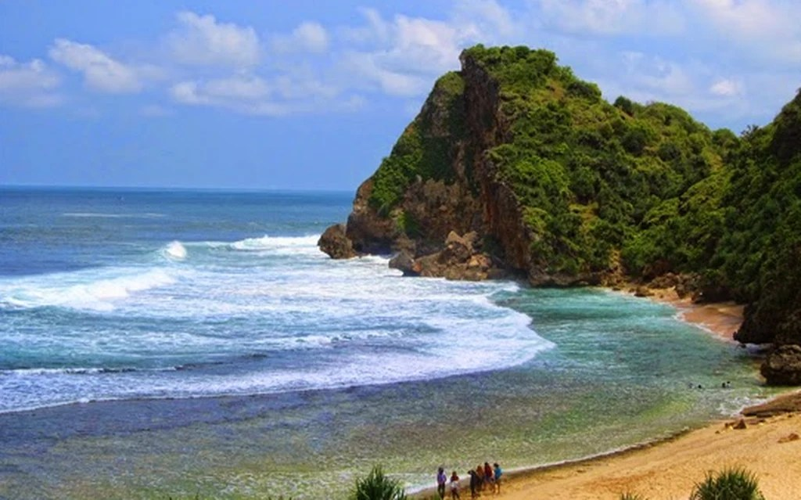
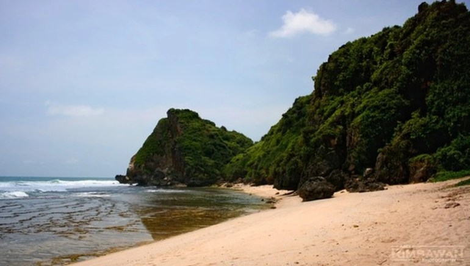
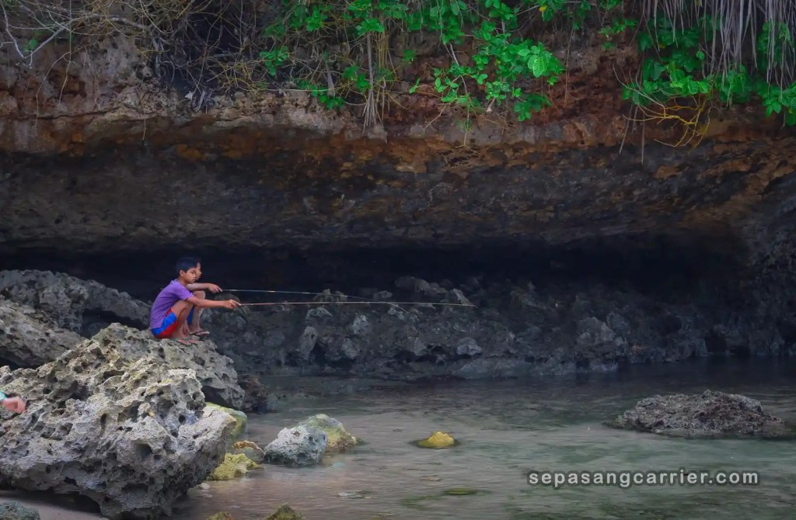

Pantai Nguyahan adalah salah satu pantai di Gunung Kidul yang belum cukup terkenal. Pantai ini terletak di dekat Pantai Ngobaran. Ya meskipun pemandangannya tak kalah indah dengan Pantai Ngobaran, tetapi masih banyak wisatawan yang tahu pantai yang satu ini.

Wajar saja, pantai yang lebih terkenal adalah Pantai Ngobaran. Oiya, ada lagi pantai kecil yang bisa memberikanmu sensasi berlibur di _private beach_, namanya [Pantai Pringjono](https://www.infopantai.com/pantai-pringjono/).

Kembali lagi ke Pantai Nguyahan, pantai ini juga bisa menjadi alternatif pilihanmu ketika bingung hendak bermai ke pantai mana. Selain akses jalan yang sudah cukup baik, tersedia area parkir yang cukup luas. Jadi, kamu tak perlu khawatir tidak kebagian tempat parkir.

Lokasi, Alamat, dan Rute Pantai Nguyahan
----------------------------------------

Masih sama dengan Pantai Pringjono, Nguyahan terletak di Desa Kanigoro, Kecamatan Saptosari, Kabupaten Gunung Kidul, Daerah Istimewa Yogyakarta.

Dari kota Yogyakarta, kamu bisa melewati Jalan Panggang. Rutenya juga masih sama dengan Pantai Kanijoro yang pernah saya buat sebelumnya. Mulai dari Jalan Imogiri Timur ke selatan, naik di Jalan Panggang. Selanjutnya, menuju timur ke arah Saptosari, lalu ke arah Pasar Trewono. Setelah dari Pasar Trewono ambil arah Kanigoro. Ikuti jalan kamu akan sampai di Pantai Nguyahan.

https://www.nativeindonesia.com/pantai-nguyahan/

Kalau kamu dari Kota Yogyakarta, saya tidak menyarankan melewati Jalan Wonosari. Hal ini dikarenakan seolah-olah kita harus berputar terlebih dahulu untuk mencapai pantai ini. Selain menghabiskan bahan bakar, perjalanan juga terasa lebih lama.

### Lokasi Pantai Nguyahan

Kalau di Google Maps, jangan heran kalau nama pantai ini digabung dengan nama pantai sebelah. Namanya di Google Maps adalah Pantai Nguyahan dan Pantai Ngobaran. Mungkin karena pantainya berdekatan dan Pantai Ngobaran yang lebih terkenal, bisa jadi Pantai Nguyahan "pansos" dari Pantai Ngobaran. Untuk lebih detailnya, kamu bisa melihat peta dari Google Maps berikut ini.

Harga Tiket Masuk dan Jam Operasional
-------------------------------------

Sebagai bentuk kontribusi aktif sebagai pengunjung, kamu perlu membayar tiket masuk. Namun, tenang saja kamu tak perlu membayar mahal untuk menikmati keindahan Pantai Nguyahan. Cukup bayar 5 ribu rupiah sebagai tiket masuk, 2 ribu rupiah untuk parkir kendaraan roda dua, atau 5 ribu rupiah untuk parkir mobil.

Sedikit berbeda dengan pantai di sekitarnya, Pantai Nguyahan tampaknya tidak buka selama 24 jam. Kalau dilihat dari Google Maps, jam operasionalnya dari jam 08.00 sampai jam 18.00. Namun, ada kontak yang bisa kamu hubungi jika memerlukan informasi tambahan.

Hal Unik dari Pantai Nguyahan
-----------------------------

Meski serupa tentu tak sama adalah salah satu peribahasa yang bisa mewakili pemandangan Pantai Nguyahan. Setiap pantai memiliki pemandangan yang mirip-mirip. Namun, pantai ini memiliki kekhasannya sendiri. Berikut ini beberapa keunikan Pantai Nguyahan.

https://www.fankymedia.com/lokasi-objek-wisata-pantai-nguyahan-gunung-kidul-jogja/

_Entah kenapa di tulisan ini banyak peribahasa yang muncul, hahaha. Semoga kamu tetap menikmati tulisan ini, ya. Selain melihat-lihat ulasan pantai, sekalian belajar bahasa Indonesia, eheheh._

### Pantai Penghasil Garam

Diambil dari laman brisik.id, dulunya (ketika zaman Belanda) Pantai Nguyahan adalah salah satu pantai penghasil garam. Dalam bahasa Jawa, kata _uyah_ berarti garam. Karena dulunya tempat penghasil garam, jadi masyarakat sekitar menamainya dengan Pantai Nguyahan. Kurang lebih artinya tempat yang membuat atau bertani _uyah_ (garam).

Untuk saat ini, hanya beberapa saja yang masih menekuni sebagai petani garam. Jika kamu beruntung, kamu akan melihat warga sekitar yang sedang bertani garam. Tentunya, menjadi keunikannya sendiri ketika melihat petani garam yang sedang bekerja.

### Dikelilingi Bukit

Kalau kita memandang sekeliling, pantai ini sebenarnya tidak terlalu luas. Di kanan kirinya terdapat bukit-bukit yang mengelilingi bibir pantai ini. Uniknya lagi, bukit-bukit tersebut ditumbuhi bermacam-macam tanaman hijau sehingga memberi warna dominasi hijau. Menjadi paduan yang amat indah ketika bertemu warna oranya menjelang matahari menyembunyikan dirinya.

https://travel.detik.com/cerita-perjalanan/d-5405013/suket-paris-sisi-lain-kehidupan-di-pantai-nguyahan

### Jarang Dijamah

Bagi kamu yang ingin merasakan nikmatnya menyatu dengan alam, kamu juga bisa mendirikan tenda di sekitar bibir pantai. Sayangnya, tidak seperti Pantai Sadranan yang beberapa kiosnya menyewakan tenda, di Pantai ini tidak ada kios yang menyewakan tenda. Jadi, siapkan segala peralatan _camping_ dengan baik.

Sekada himbauan, kalau kamu mau nge-_camp_ di sini, tetap jaga kebersihan pantai ini, ya. Sebenarnya tak hanya yang mau nge-camp sih, tapi siapa pun yang berkunjung ke tempat ini, jagalah kebersihannya!

Karena masih dibilang pantai yang cukup sepi, tak heran jika tidak ada sampah berserakan. Hanya terdapat satu dua sampah plastik dan sampah sisa-sisa kayu di bibir pantai.

Selain nge-_camp_, kamu bisa melakukan aktivitas-aktivitas menarik lainnya, _lho_. Kalau kamu gemar bermain air, kamu bisa main air di tepian untuk merasakan menjanya ombak yang menyapa kakimu. Di sisi yang lain, kamu juga bisa menghabiskan waktumu untuk memancing. Kalau memancing, siapkan umpan dan peralatanmu, ya.

https://www.sepasangcarrier.com/2019/02/pantai-nguyahan-gunung-kidul-yogyakarta.html

Gimana? Udah _mantep_ mengunjungi Pantai Nguyahan? Kalau belum mantap dan ada informasi yang ingin kamu tanyakan, tinggalkan saja pertanyaanmu di kolom komentar.

Selamat berlibur!