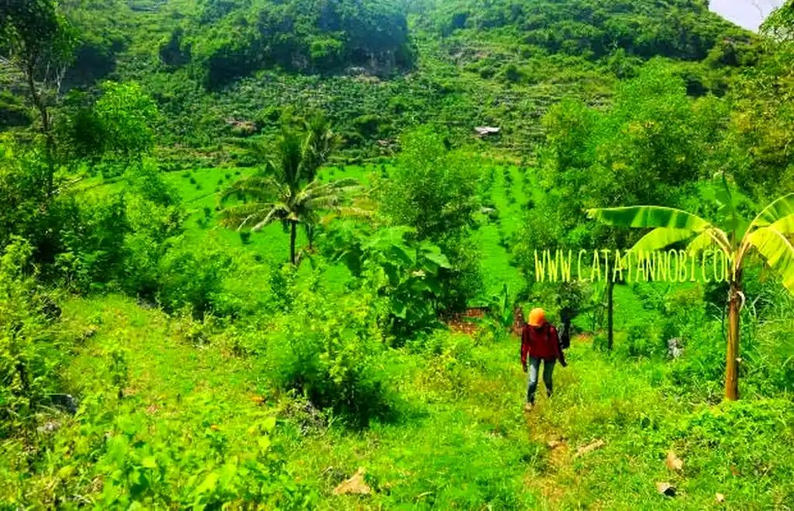
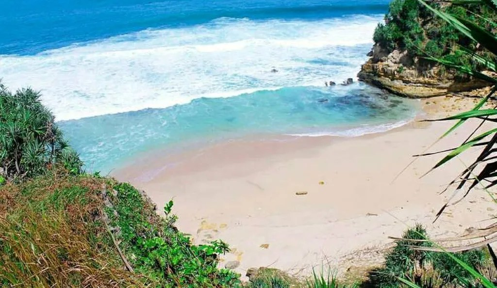
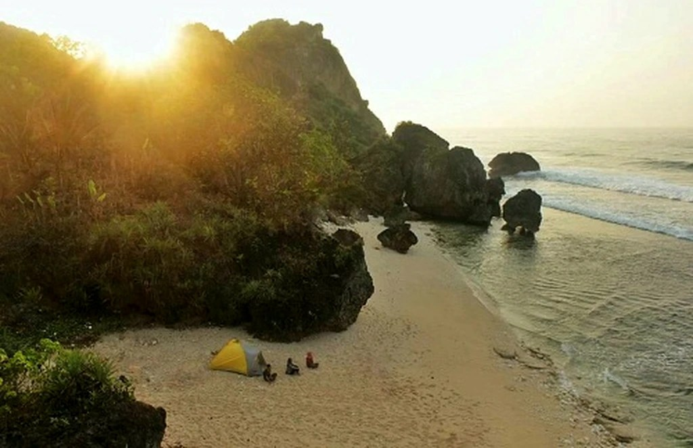

Pantai Pringjono adalah salah satu pantai yang terletak di Gunung Kidul, Yogyakarta. Ukuran pantai ini terbilang kecil dibandingkan pantai-pantai yang lain.

Untuk sampai ke bibir Pantai Pringjono, kamu harus berjalan kaki terlebih dahulu melewati rute berbatuan dengan jalan setapaknya. Tidak heran banyak orang lebih memilih untuk mengunjungi pantai yang lain.

Namun, bagi kamu yang ingin merasakan sensasi pantai pribadi dan sensasi _tracking_, Pantai Pringjono menjadi salah satu pantai yang wajib kamu kunjungi. Pemandangan yang ada di pantai ini juga tak kalah menariknya dengan pantai-pantai lainnya.

Mulai dari bebatuan di bibir pantai dan tepi tebing. Di bawah, terdapat batu karang yang elok, tebing yang kuat menahan hempasan ombak, hingga pasir putih yang halus, dan air laut yang sangat jernih.

Lokasi, Alamat, dan Rute Pantai Pringjono
-----------------------------------------

Pantai Pringjono terletak di Desa Kanigoro, Kecamatan Sapto Sari, Kabupaten Gunung Kidul. Kalau mendengar nama pantai ini, kamu pasti akan merasa asing bukan? Ya, wajar saja, pantai yang satu ini masih sepi pengunjung.

Kalau kamu beruntung, kamu bisa merasakan sensasi _private beach_ di pantai ini. Sudah pernah merasakan sensasi sendirian di pantai? Belum? Kalau belum, kamu bisa mencoba keberuntunganmu di pantai ini. Kalau pas sendirian di pantai kan lumayan, bisa teriak-teriak sepuasnya, bermain air sepuasnya. Yang tak kalah penting, menikmati keindahan pantai tersebut tanpa ada gangguan.

Sumber: Catatannobi.com

Seperti yang kutulis di awal, untuk mencapai bibir Pantai Pringjono, kamu harus berjalan menyusuri jalan setapak terlebih dahulu. Kamu bisa memarkirkan kendaraanmu di Pantai Nguyahan.

Kalau kamu dari Kota Yogyakarta, terdapat dua rute yang bisa kamu gunakan. Rute Jalan Wonosari dan Rute Jalan Panggang. Sama seperti rute ke [Pantai Wohkudu](https://www.infopantai.com/wohkudu/), aku lebih menyarankan kamu melewati Jalan Panggang. Tak lain dan tak bukan karena jalannya yang terasa lebih dekat, tanpa harus _ngalang_ atau berputar terlebih dahulu.

Dari Pantai Nguyahan, kamu harus berjalan kaki sekitar satu setengah kilometer atau sekitar 30 menit untuk mencapai pantai ini. Selama perjalanan, kamu akan melihat ladang atau kebun milik warga. Jangan sungkan untuk menyapa ataupun bertanya pada mereka ya. Warga di sana terkenal ramah-ramah, kok.

Harga Tiket Masuk dan Jam Operasional
-------------------------------------

Sepegalamanku, ketika berkunjung ke tempat ini, belum ada harga tiket masuk. Artinya, kamu cukup membayar di retribusi yang ada di Pantai Nampu. Tidak perlu merogoh kocek terlalu dalam, cukup 5ribu rupiah per orang, kamu bisa mengunjungi dua pantai sekaligus (dengan catatan kalau kuat jalannya, ya! _Hihi_).

Masalah jam operasional, tidak ada batasan waktu yang ditentukan. Jadi, kamu bebas mengunjungi pantai ini selama 24jam. Kalau kamu ingin mengunjungi di malam hari, siapkan penerangan, ya. Jalan menuju ke Pantai Pringjono masih belum ada penerangan.

Hal Unik dan Fasilitas di Pantai Pringjono
------------------------------------------

Setiap pantai pasti memiliki pesonanya masing-masing. Meskipun terdapat kemiripan satu dengan yang lain, tetapi tidak ada yang serupa. Berikut ini keunikan dari Pantai Pringjono

### Mata Air yang Airnya Tawar

Melansir dari Detik, salah satu keunikan yang ada di Pantai Pringjono adalah adanya sumber mata air di dekat bibir pantai. Biasanya kalau di dekat bibir pantai, air yang muncul adalah air laut (asin), bukan? Namun, air yang keluar dari mata air ini bukanlah air laut, melainkan air tawar.

Orang-orang di sekitar sana meyakini, air yang keluar dari mata air tersebut berkhasiat untuk mengobati segala penyakit. Nah, gimana? Semakin tertarik mengunjungi Pantai Pringjono? Meski begitu, kalau kamu ingin meminum air tersebut, ada baiknya direbus atau difilter terlebih dahulu, ya.

### Serasa Milik Sendiri

Seperti yang sudah kutuliskan sebelum-sebelumnya, Pantai Pringjono akan menyuguhkan nikmatnya menyepi di pantai ini. Ketika sampai di Pantai Pringjono, yang ada hanyalah ombak yang menyapa lewat deburannya, semilir angin yang membelai kulit nan menyibak rambut, juga panas matahari yang senantiasa memberi kehangatan.

Sumber: libur.co

Lebih baik kalau kamu berpikir dua kali kalau ingin ngecamp di sini. Selain jalan menuju jalanan umum harus ditempuh berjalan kaki, sensasi sepi akan menembus dalamnya hati (_hahaha_). Namun, kalau kamu suka menyepi dan menikmati petualangan, pantai ini menjadi tempat pilihan untuk nge-camp.

Sumber: Sobatjogja.com

Oiya, kalau kamu ingin mengunjungi Pantai Pringjono, pastikan kendaraan, sopir, juga badanmu dalam keadaan prima, ya karena perjalanannya cukup memakan tenaga.

Gimana? Udah mantap mengunjungi pantai ini? Selamat berlibur!