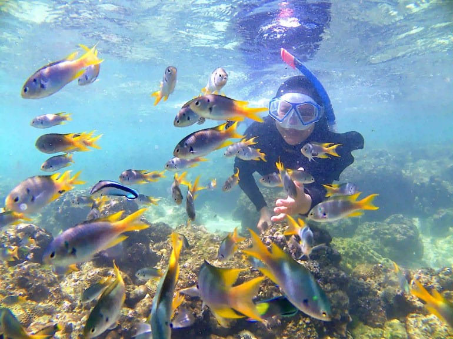
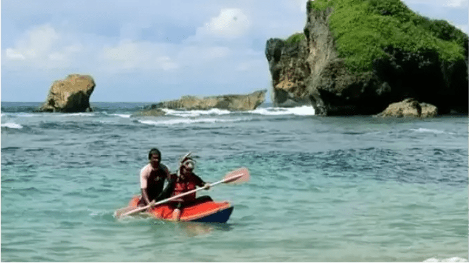
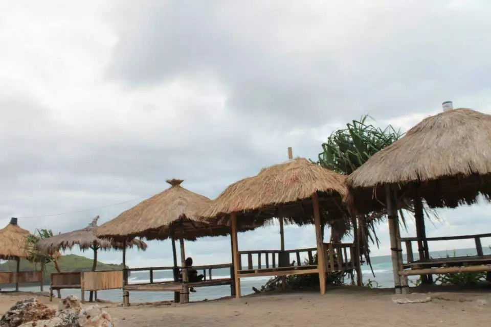
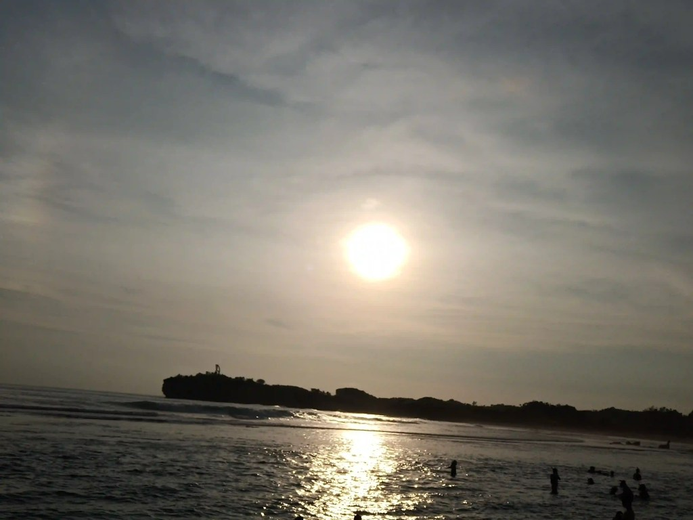

Pantai Sadranan Jogja adalah salah satu pantai yang ada di Gunung Kidul. Seperti yang kita tahu, Gunung Kidul adalah salah satu kabupaten di DI Yogyakarta yang masih menyimpan pantai-pantai yang menarik untuk dikunjungi.

Lokasi, Alamat, dan Rute Pantai Sadranan
----------------------------------------

Salah satu pantai yang bisa kamu kunjungi adalah Pantai Sadranan, sekitar 63 kilometer dari Kota Yogyakarta. Pantai Sadranan terletak di Pule Gundes II, Tepus, Kecamatan Tepus, Kabupaten Gunung Kidul, Daerah Istimewa Yogyakarta. Dari kota Yogyakarta, kamu bisa menggunakan kendaraan pribadi selama satu hingga dua jam jika jalanan tidak macet untuk mencapai Pantai Sadranan.

Terdapat dua rute yang bisa kamu gunakan untuk mencapai Pantai Sadranan. Rute pertama adalah Jalan Wonosari. Dari arah Piyungan, mengikuti jalan sampai arah Wonosari. Di Jalan Baron, pergi ke selatan mengikuti jalan hingga masuk ke jalan utama Pantai Sadranan.

Selain Jalan Wonosari, kamu juga bisa melewati Jalan Panggang. Dari Dari Jalan Imogiri Timur, naik menuju Jalan Panggang, ikuti jalan saja sampai Perempatan Legundi. Di Perempatan Legundi, ambil arah timur sampai masuk di Jalan Pantai Selatan Jawa, lalu ke selatan di Jalan Sadranan-Slili.

### Lokasi Pantai Sadranan Jogja

Untuk lebih detailnya, kamu bisa melihat Rute dari Google Maps di bawah ini.

Memang perjalanannya cukup memakan waktu. Namun, hal ini bukan menjadi masalah yang berarti karena kamu akan melihat pemandangan indah sepanjang perjalanan.

Harga Tiket Masuk, Jam Operasional Pantai Sadranan
--------------------------------------------------

Untuk menikmati keindahan Pantai Sadranan, kamu cukup merogoh kocek sebesar Rp10.000 per orang. Tenang saja, harga ini sudah termasuk tiket retribusi untuk pantai lainnya, contohnya [Pantai Slili](https://www.infopantai.com/pantai-slili/).

Untuk biaya parkir masih terbilang standar, 2 ribu rupiah untuk motor dan 5 ribu rupiah untuk mobil.

Bicara mengenai jam operasional, pantai ini bisa buka 24 jam. Namun, jangan heran jika menjelang datangnya malam sudah mulai sepi.

Fasilitas di Pantai Sadranan Jogja
----------------------------------

Meskipun terletak di kawasan pantai Gunung Kidul yang terkenal dengan batu karangnya, Pantai Sadranan terbilang memiliki batu karang yang sedikit dibanding pantai lainnya. Bisa jadi itu menjadi salah satu alasan juga pantai ini menyediakan "wahana" _snorkling_.

### Snorkling

Bagi kamu yang hobi berenang, pantai ini cocok untukmu. Di Pantai Sadranan, terdapat kios-kios yang menyewakan fasilitas _snorkling_ atau _diving_. Untuk menyewa peralatan snorkling selama 60 menit, kamu cukup membayar 50ribu hingga 100ribu rupiah, tergantung kios mana yang kamu pilih.

Selain alat yang mumpuni, ada _guide_ yang akan menemanimu untuk menikmati pemandangan alam bawah laut, memfoto kamu, sampai membantu menjaga keselamatanmu, _lho_. Oiya, meski sudah ada _guide_, tetap perhatikan keselamatan dirimu sendiri, ya!

GoogleMaps/Try Agus

Pihak pengelola membuat jadwal tersendiri untuk _snorkling_. Tak lain dan tak bukan agar pengunjung mendapat pengalaman snorkling yang lebih menakjubkan. Ada dua jam operasional _snorkling_ di Pantai Sadranan, pagi pukul 06.00 hingga 08.00 dan sore pukul 16.00 sampai 18.00.

### Perahu Kano

Jika kamu tak ingin bermain-main dengan adrenalin, Pantai Sadranan masih menyediakan fasilitas lain untuk menikmati keindahan pantai ini, perahu kano.

Dengan menyewa perahu kano sebesar 50 ribu rupiah, kamu bisa menikmati deburan ombak yang menghempas perahumu. Lagi-lagi, tak perlu khawatir karena ada alat pengaman dan _guide_ yang mendampingimu dalam setiap perjalanan mendayungmu.

Sumber: Jogjakita.com

Dari atas perahu kano, kamu juga bisa menikmati indahnya pemandangan bukit dan tebing yang mengitari Pantai Sadranan. Jadi, selain olahraga, dengan menyewa perahu kano kamu juga sekalian cuci mata dengan yang _seger-seger_, _hehehe_.

### Tempat Teduh

Bagi kamu yang tak ingin bermain-main di air, kamu bisa merasakan angin yang tak bosan-bosan membelai kulit dan menyibak rambutmu di pinggiran pantai. Ada beberapa gazebo atau saung yang bisa kamu gunakan untuk menikmati ombak yang bermanja-manja dengan pasir.

Sumber: GoogleMaps/Dwi Ratnasari Lewi

Jadi, bagi kamu yang ingin terhindar dari terik matahari, kamu bisa menyewa saung atau gazebo tersebut dengan membayar 10 hingga 20ribu. Di sisi pantai yang lain, ada juga yang menyewakan tikar dengan harga sewa 20ribu rupiah.

### Spot Camping

Ingin merasakan bermalam di tepian pantai? Pantai Sadranan pun bisa merealisasikannya! Karena daerah pantainya yang cukup luas, kamu bisa mendirikan tenda di tempat tersebut.

Selain itu, kamu juga bisa membuat api unggun dengan tetap memperhatikan kebersihan lingkungan ya. Jangan meninggalkan sampah sisa bakar-bakarmu karena bisa mengganggu keindahan Pantai Sadranan ini.

Tak punya alat _camping_? Tak jadi masalah! Tidak sama seperti Pantai Jungwok, di Pantai Sadranan ada juga persewaan alat _camping_. Namun, akan lebih baik jika konfirmasi terlebih dahulu dengan pengelola mengenai persewaan alat camping ini. Takutnya, tidak ada tenda tersisa di kios tersebut.

Untuk menyewa tenda, kamu cukup mengeluarkan uang 50 ribu saja. Dengan uang 50 ribu rupiah, kamu bisa menikmati nge-_camp_ dengan tenda _dome_ kapasita 4 orang.

### Akomodasi Cukup Lengkap

Kalau mau _camping_, kamu pasti akan berpikir bagaimana "hidup" di sana, apakah ada tempat makannya, atau bagaimana memenuhi kebutuhan MCK? Benar begitu bukan?

Tak perlu khawatir untuk itu, ada beberapa warga lokal yang berjualan makanan di situ, mulai dari makanan ringan hingga makanan berat. Untuk keperluan MCK juga tak perlu dikhawatirkan karena kamar mandinya terbilang cukup bersih.

### Spot Foto

Rasa-rasanya tak lengkap mengunjungi tempat wisata tanpa mengabadikan momen tersebut. Di Pantai Sadranan Gunung Kidul, kamu bisa mengabadikan momenmu di beberapa spot yang _caem_.

Misalnya saja foto bawah laut, foto bawah laut ini bisa dilakukan ketika kamu snorkling ya. Jadi, sembari snorkling, kamu bisa meminta foto kepada petugas (untuk informasi biayanya, akan saya _update_ setelah memiliki informasi yang valid ya!).

Sumber: GoogleMaps/[Kaka Kristin](https://www.google.com/maps/contrib/118408704302137308801)

Tempat ini juga cocok dikunjungi bagi kamu yang gemar memburu _sunrise_ maupun _sunset_. Jika tiba saatnya sunrise, kamu akan melihat bangunnya matahari untuk menyinari dunia ini dengan latar belakang perbukitan dan hamparan laut yang luas.

Sama seperti _sunrise_, ketika _sunset_, kamu bisa menikmati matahari yang perlahan undur diri dengan latar bukit dan hamparan Laut Jawa yang luas.

Penginapan di Pantai Sadranan Jogja
-----------------------------------

Kalau kamu ingin merasakan penginapan murah di Pantai Sadranan, kamu bisa memilih salah satu dari beberapa info penginapan. Oiya, biaya penginapan yang di sekitar sana pun cukup murah, mulai dari 200 ribu rupaih per malam.

Tak perlu khawatir juga masalah fasilitas. Penginapan yang ada di sekitar Pantai Sadranan bisa diandalkan karena harganya terjangkau nan fasilitas yang lengkap. Penginapan-penginapan ini juga meberikan kenyaman bagi pengunjungnya.

### Penginapan BoB hOme

Nama yang mudah untuk diucapkan, tetapi entah kenapa terdapat huruf kapital yang membut sulit untuk diketikkan. Meskipun namanya sulit diketikkan, penginapan yang satu ini memberikan kenyaman untuk beristirahat di sekitar Pantai Sadranan.

Untuk bermalam di penginapan ini, kamu harus mengeluarkan kocek 200 ribu rupiah per malamnya. Di penginapan ini, kamu akan mendapatkan pelayanan yang baik nan ramah, kamar wangi dan bersih, pemandangannya pun sangat bagus untuk melihat _sunset_ maupun _sunrise_.

### Bungalo Bambu Sadranan

Penginapan unik yang satu menyuguhkan pengalaman pengunjung untuk bermalam di bangunan berbahan bambu. Jika kamu bermalam di penginapan ini, kamu akan melihat pemandangan pantai dengan sangat jelas. Harga sewa per malamnya sekitar 200 ribu rupiah.

Kalau sudah bosan tidur-tiduran di penginapan, kamu bisa berjalan sedikit ke belakang untuk "terjun" lagi ke pantai. Bisa dibilang, penginapan ini dibangun masih di bibir Pantai Sadranan.

Gimana? Udah punya gambaran mengenai Pantai Sadranan Jogja?

Meski tak bisa menggambarkan situasi dan kondisi lengkap di Pantai Sadranan lewat tulisan ini, saya berharap kamu bisa menikmati suasana Pantai Sadaranan secara langsung.

Sewaktu berkunjung, jangan lupa tetap menjaga kebersihan, ya! Selamat halan-halan!
