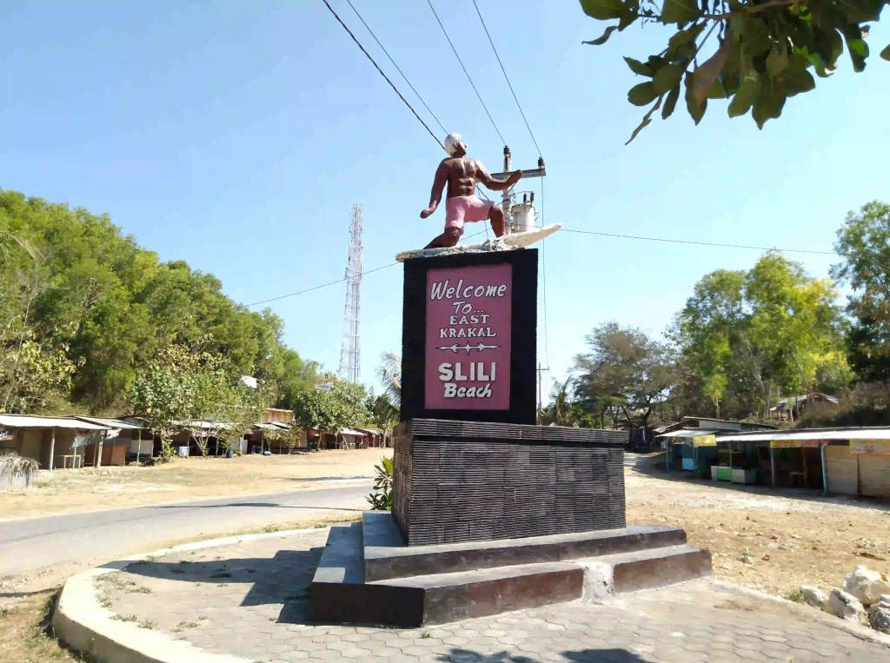
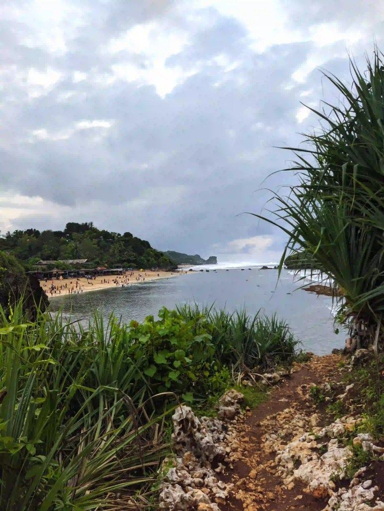
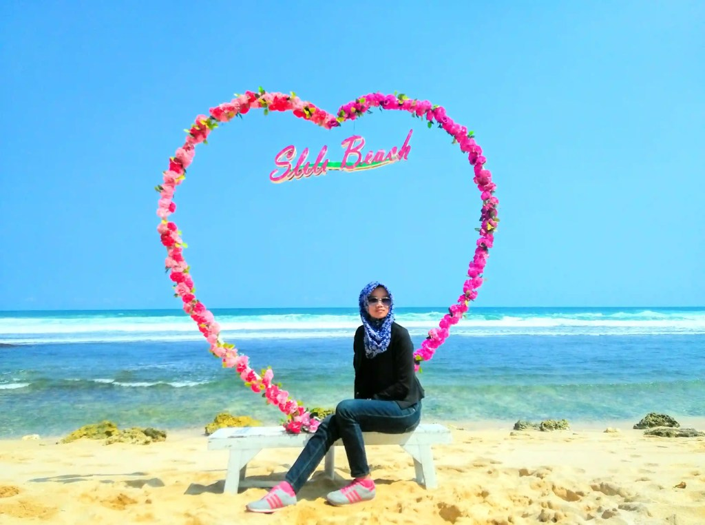

Mengunjungi Pantai Slili seperti kata pepatah, satu sekali mendayung dua tiga pulau terlampaui. Wajar saja, jarak antar pantai di Gunung Kidul masih berdekatan. Sebagai contoh, [Pantai Sadranan](https://www.infopantai.com/pantai-sadranan/) adalah salah satu pantai yang berdekatan dengan Pantai Sili.

Lokasi, Alamat, dan Rute Pantai Sadranan
----------------------------------------

**Pantai Slili terletak di mana?**

Pantai Slili terletak di Jalan Panti Krakal, Tepus, Gunung Kidul, Daerah Istimewa Yogyakarta. Dari Kota Yogyakarta, kamu harus menempuh perjalanan kurang lebih 80 kilometer. Jika ditempuh menggunakan motor atau mobil, akan memakan waktu sekitar dua jam perjalanan.

Ada dua rute yang bisa kamu lalui untuk mencapai Pantai Slili. Ruti pertama adalah Jalan Wonosari. Jika kamu melewati Jalan Wonosari, kamu akan menikmati pemandangan khas perjalanan gunung yang naik turun dan berkelok-kelok. Dari Jalan Wonosari, menuju daerah Tepus, ke selatan terus hingga masuk jalan utama Pantai Sadranan.

Google Maps/F H

Selain itu, kamu juga bisa melewati Jalan Panggang. Pemandangan di perjalanan kurang lebih sama dengan Jalan Wonosari. Yang sedikit berbeda Jalan Panggang terkesan lebih sepi dari pengguna jalan lain.

Rute yang bisa kamu ambil jika memilih Jalan Imogiri sebagai berikut. Dari Jalan Imogiri Timur, naik menuju Jalan Panggang, sampai Perempatan Legundi. Selanjutnya, arah timur sampai masuk Jalan Pantai Selatan Jawa, lalu ke selatan di Jalan Sadranan - Slili.

### Lokasi Pantai Slili Gunung Kidul

Jika kamu masih tak puas dengan penjelasan secara teks, kamu bisa mengecek berbagai rute dari Google Maps berikut ini.

Harga Tiket Masuk dan Jam Operasional
-------------------------------------

Sebagai salah satu tempat wisata yang adai Gunung Kidul, kita harus merogoh kocek di tempat pembayaran retribusi (TPR). Mungkin kalau kamu punya _jalan tikus_ (jalan pintas) bisa masuk secara cuma-cuma. Namun, kalau seperti itu, siapa yag akan memberi sumbangan untuk pengembangan Pantai Slili? _hehehe_

**Ke Pantai Slili Bayar Berapa?**

Kamu cukup mengeluarkan uang 10 ribu rupiah per orang. Dengan biaya tersebut, kamu juga bisa menikmati pantai-pantai lain yang ada di sekitar Pantai Slili. Selanjutnya, siapkan juga uang 2000 rupiah untuk parkir motor atau 5000 rupiah untuk parkir mobil.

**Apakah Pantai Slili Buka?**

Hingga tulisan ini dibuat, Pantai Slili tetap buka dengan jam operasional 24 jam. Namun, kebijakan ini bisa berubah sewaktu-waktu ya.

Fasilitas yang Ada di Pantai Slili
----------------------------------

Ada beragam fasilitas yang di Pantai Slili, Gunung Kidul. Beberapa di antaranya bisa kamu nikmati secara cuma-cuma. Namun, jangan heran kalau ada yang harus mengeluarkan kocek untuk menikmati fasilitas tersebut.

### Snorkeling

Masih sama seperti Panti Sadranan Jogja, Pantai Slili juga menyediakan fasilitas snorkeling bagi pengunjungnya. Mungkin karena ekosistemnya masih mirip-mirip, jadi fasilitas yang ditawarkan pun juga mirip-mirip.

Untuk menikmati pemandangan di bawah laut dengan snorkleing, kamu cukup mengeluarkan uang sebesar 50 ribu rupiah saja. Dengan 50 ribu rupiah, kamu bisa menyapa nan menjelajah penghuni luasnya lautan Jawa.

Kalau enggak bisa renang gimana? Tenang saja, harga di atas sudah termasuk pemandu atau _guide_ yang sigap mengarahkan, sekaligus membantumu dalam bermain-main air. Tak hanya itu, beliau-beliau ini juga akan membantumu dalam pengambilan gambar.

### Melihat Udang yang Berkejaran

Selain melihat biota laut sambil menyelam, kamu juga bisa melihat udang-udang yang bersembunyi di sela-sela karang. Jika kamu mau, kamu bisa membantu warga sekitar untuk mengambil udang-udang tersebut.

Menjadi keberuntungamu jika kamu berkunjung ke sini waktu musim kemarau. Ketika musim kemarau, akan lebih banyak rumput laut yang bermunculun. Dengan demikian, makin banyak juga udang yang keluar dari tempat persembunyiannya.

Oiya, kalau kamu beruntung, kamu akan berjumpa dengan pasukan klomang yang malu-malu bergerak ke sana kemari. Namun, tidak setiap saat klomang ini muncul, hanya saat-saat tertentu saja.

### _**Tracking**_

Bosan bermain di air? Tracking bisa menjadi salah satu alternatif kegiatan di Pantai Slili. Kamu bisa menyusuri jalan setapak mendaki bukit yang ada di sekitar Pantai Slili.

Dari ketinggian bukit, kamu bisa melihat pemandangan mesranya Laut Jawa yang menyapa daratan Pulau Jawa. Jika melihat ke selatan, kamu akan disuguhkan luas dan birunya Laut Jawa sedangkan di sisi sebaliknya pemandangan bukit hijau nan tinggi yang mendominasi.

Google Maps/Inny Dari

### Tempat Santai dan Kulineran

Bagi kamu yang tak ingin menikmati keduanya, tenang saja ada beberapa tempat yang bisa kamu gunakan untuk sekadar bersantai-santai menikmati pemandangan.

Di bibir pantai, terdapat beberapa gazebo yang bisa kamu gunakan untuk bersantai memandang indahnya alam dan serunya orang-orang bermain air.

Sambil bersantai di gazebo, kamu bisa memesan sajian kuliner yang ada di deretan belakang gazebo. Warung-warung di sekitar sana menyediakan berbagai makanan, mulai dari makanan ringan sampai makanan berat. Sedikit tips, sebelum mulai memesan, jangan lupa tanyakan harga terlebih dahulu agar kamu terhindar hal-hal yang kurang menyenangkan (kena harga selangit misalnya, _hehehe_).

### Akomodasi Lengkap

Setelah puas bermain air ataupun tracking, jangn lupa untuk membersihkan diri ya! Tenang saja, di Pantai Slili sudah tersedia kamar mandi yang cukup bersih dan banyak. Jadi, kamu tak perlu khawatir untuk masalah MCK.

### Spot Foto yang Keren

Seperti yang sudah kusinggung di awal, kamu bisa mengambil foto bawah laut dengan bantuan _guide_. Jika ingin berfoto di daratan juga bisa, kok. Di sini terdapat banyak spot foto yang menarik nan keren. Jadi, kamu bisa mengabadikan momen-momenmu ketika di Pantai Slili.

Google Maps/Lina Kurniyawati

Penginapan Pantai Slili
-----------------------

Terdapat lumayan banyak penginapan yang ada di sekitar Pantai Slili. Kamu bisa menggunakan rekomendasi di bawah untuk membantumu dalam memilih tempat penginapan.

Tempat penginapan yang disewakan memiliki harga yang variatif, tergantung fasilitas yang disediakan. Ada penginapan dengan harga 100ribuan, hingga yang hampir menyentuh satu jutaan rupiah per malamnya.

### Gubug Asmoro Nglolang

Penginapan termurah yang ditunjukkan [Google Hotels](https://www.google.com/travel/hotels/Pantai%20Slili?q=penginapan%20pantai%20slili&g2lb=2502548%2C2503771%2C2503781%2C4258168%2C4270442%2C4284970%2C4291517%2C4306835%2C4401769%2C4429192%2C4597339%2C4640247%2C4647135%2C4649665%2C4680677%2C4718358%2C4721475%2C4722435%2C4722900%2C4723331%2C4726607%2C4733969%2C4736007&hl=id-ID&gl=id&ssta=1&rp=ogFcUGFudGFpIFNsaWxpLCBKYWxhbiBQYW50YWkgS3Jha2FsLCBUZXB1cywgS2FidXBhdGVuIEd1bnVuZyBLaWR1bCwgRGFlcmFoIElzdGltZXdhIFlvZ3lha2FydGE4AUAASAI&ap=MAFaxgEKBgiA6jAQACIDSURSKhYKBwjmDxADGBsSBwjmDxADGBwYASgAsAEAWAFoAXIECAIYAJoBXhJcUGFudGFpIFNsaWxpLCBKYWxhbiBQYW50YWkgS3Jha2FsLCBUZXB1cywgS2FidXBhdGVuIEd1bnVuZyBLaWR1bCwgRGFlcmFoIElzdGltZXdhIFlvZ3lha2FydGGiAR0KDS9nLzExYjZwZjF4amsSDFBhbnRhaSBTbGlsaaoBCwoDCOECEgIIYxgBkgECIAFoAA&ictx=1&sa=X&utm_campaign=sharing&utm_medium=link&utm_source=htls&ts=CAESCgoCCAMKAggDEAAagAEKYhJeOlxQYW50YWkgU2xpbGksIEphbGFuIFBhbnRhaSBLcmFrYWwsIFRlcHVzLCBLYWJ1cGF0ZW4gR3VudW5nIEtpZHVsLCBEYWVyYWggSXN0aW1ld2EgWW9neWFrYXJ0YRoAEhoSFAoHCOYPEAMYGxIHCOYPEAMYHBgBMgIQACoLCgcoAzoDSURSGgA&ved=0CAAQ5JsGahcKEwiQpNvDzOH2AhUAAAAAHQAAAAAQZQ) adalah Gubuk Asmoro Nglolang. Penginapan Gubug Asmoro Nglolang terletak sekitar 7 km atau 17 menit dari Pantai Slili. Jarak yang cukup jauh ini, biasanya akan menambah kemageran untuk bolak-balik penginapan - pantai, pantai penginapan.

Untuk menikmati bermalam di Gubung Asmoro, kamu perlu merogoh kocek cukup seratus ribu rupiah. Jika ada promo, bisa lebih murah lagi. Baik juga kalau kamu memantau beberapa situs penjualan tiket untuk mendapatkan informasi harga tiket terbaru.

Sayangnya, di penginapan ini tidak menyediakan WiFi. Jadi, kamu harus mencari koneksi internet sendiri untuk berselancar di dunia maya. Namanya di pantai, jangan heran kalau sinyal HP-mu sering hilang hingga menyebabkan _pending_.

### Penginapan BoB hOme

Masih sama seperti tempat wisata di Sadranan, tempat wisata ini dekat dengan Penginapan Bob HOme. Kamu bisa mencicipi fasilitas Penginapan Bob Home hampir sepanjang hari.

Jangan heran dengan pelayanannya yang sangat ramah dan rapi ketika bermalam di Bob Home. Mungkin karyawan yang kerja di sana diharuskan memiliki kriteria tersebut, _hehe_.

Dari laman Google Hotels, untuk bermalam di Bob Home, kamu harus mengeluarkan kocek lebih dalam lagi, sekitar 200 ribu rupiah per malam. Fasilitas umum yang ada di kedua tempat Gubug Asmoro Nglolang dan Penginapan Bob hOme. Terdapat kamar mandi, kasur berserta bantalnya.

Gimana? Udah punya gambaran untuk ke Pantai Slili? Oiya, sedikit tips, untuk mencapai Pantai Slili tetap hati-hati ya. Pastikan kendaraan dan pengemudi dalam kondisi prima.

Selamat berlibur!