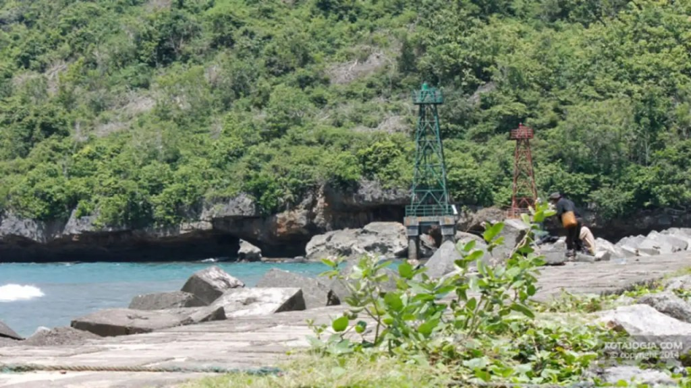
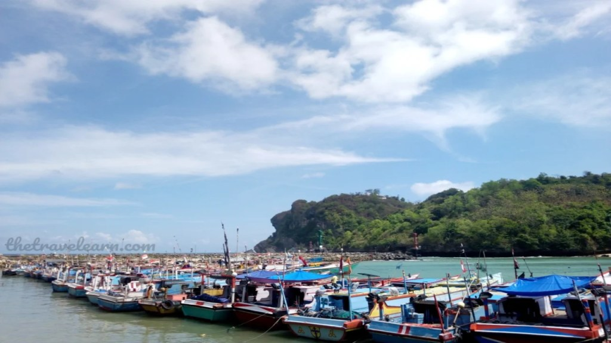
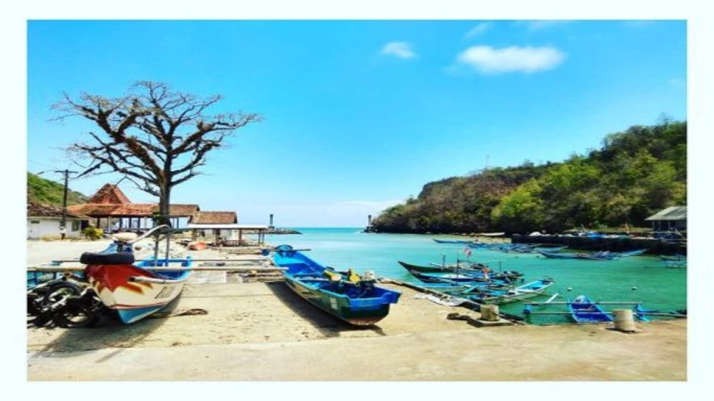

Pantai Sadeng adalah pantai unik yang ada di selatan Pulau Jawa. Pantai selatan Jawa yang biasanya berhiaskan pasir putih, pantai ini tidak hanya berhiaskan pasir pantai putih, di sekitarnya terdapat kapal-kapal nelayan yang sedang berlabuh.

Usut punya usut, pantai sadeng menjadi salah satu pelabuhan perikanan besar di Yogyakarta. Wajar saja, sejauh mata memandang, terdapat kapal-kapal yang berlabuh. Saat jam-jam tertentu, tampak satu dua kapal yang menepi dari luasnya lautan.

Setelah kapal-kapal tersebut menepi, orang-orang tampak sibuk untuk mengeluarkan hasil tangkapan mereka di laut. Berjalan beberapa ratus kilometer, terdapat tempat penjualan ikan yang tentu saja masih segar karena hasil tangkapan hari itu juga.

Lokasi dan Rute Pantai Sadeng
-----------------------------

Terletak di Desa Songbanyu, kecamatan Girisubo, Kabupten Gunung Kidul, Daerah Istimewa Yogyakarta, pantai ini seolah melambai-lambai minta dikunjungi.

Kalau dari Kota Yogyakarta, Anda memerlukan waktu sekitar 1 hingga 1 setengah jam untuk mencapai Pantai Sadeng menggunakan kendaran pribadi seperti motor ataupun mobil. Wajar saja, pantai ini terletak lebih kurang 80 kilometer dari Kota Yogyakarta.

Terdapat beberapa rute yang dapat Anda lalui dari Kota Yogyakarta. Sama seperti Pantai Wediombo, akan lebih menghemat waktu dan tenaga jika ke arah Wonosari.

Dari Jalan Piyungan, naik terus hingga menuju Jalan Wonosari, ke arah Pathuk. Kemudian ke arah Sambipitu, ke arah Gading. Dari Gading ke selatan ke arah Siyono.

Ikuti jalan ke arah Semanu, ikuti jalan sampai di Girisubo. Ikuti jalan saja, Anda akan menemukan petunjuk arah menuju Pantai Sadeng.

Jalan menuju Pantai ini cukup mulus. Meski demikian, perhatikan kondisi tubuh ya. Jangan terlalu memaksakan. Jika ada kesempatan beristirahat, beristarahat sejenak sambil menikmati suasana alam yang masih asri.

Harga Tiket Masuk Pantai Sadeng
-------------------------------

Anda cukup merogoh kocek 5000 rupiah untuk memasuki lokasi Pantai Sadeng. Biaya parkir kendaraan roda dua 2000 rupiah saja. Sedangkan untuk mobil, 5000 rupiah. Sangat murah dan terjangkau bukan? Oiya, biaya tersebut dapat berubah sewaktu-waktu ya.

Alasan Harus Mengunjungi Pantai Sadeng
--------------------------------------

Berikut ini beberapa fasiltitas dan keunikan yang ada di Pantai Sadeng. Keunikan pantai ini dapat Anda jadikan sebagai alasan harus mengunjungi Pantai Sadeng.

### Kampung Nelayan

Seperti yang sudah saya tulis sebelumnya, keunikan pantai ini terletak pada kondisi pantai yang berbeda dari pantai lainnya. Pantai ini berbentuk seperti pelabuhan. Tak tanggung-tanggung, pelabuhan ini termasuk pelabihan besar di Kota Yogyakarta.

Pelabuhan ini ada karena masyarakatnya bermata pencaharian sebagai nelayan. Pada 1983, nelayan dari Gombong banyak yang berkunjung ke daerah ini. Selanjutnya, mereka mendirikan perkampungan nelayan ini.

Kalau Anda berkunjung ke Pantai Sadeng Gunung Kidul pada waktu yang pas, Anda akan melihat kesibukan masyarakat mulai dari mengisi bahan bakar, memberangkatkan kapal, kedatangan kapal, melelang ikan, hingga kesibukan wisatawan menikmati kulineran pun juga dapat Anda nikmati.

Di salah satu sisi pantai, Anda akan melihat mercusuar yang lumayan tinggi. Mercusuar ini digunakan para nelayan sebagai penunjuk arah jika melakukan aktivitas pada malam hari. Bagi wisatawan, mercusuar ini dapat dijadikan background berfoto-foto ria.

Selain mercusuar, Anda juga dapat memanfaatkan kapal-kapal yang bersandar sebagai background foto Anda. Bawalah kamera maupun memori internal yang longgar agar Anda memiliki kenangan yang dapat Anda nikmati di kemudian hari.

### Tempat Beli Ikan Murah

Karena berfokus pada perikanan, jangan heran kalau harga ikan di sini terbilang cukup murah. Jangan ragukan soal kesegaran. Ikan yang dijual di sini adalah hasil tangkapan hari itu. Jadi, kesegarannya dapat terjaga.

Meski terbilang murah, coba sekali-kali menawar harga tersebut dengan harga yang wajar. Siapa tahu, Anda dan penjual mendapatkan _win-win solution_ sehingga mendapatkan harga penawaran terbaik. Terbaik bagi Anda juga bagi penjualnya.

### Mancing di Pantai Sadeng

Kalau dari tadi membahas penangkapan ikan berbasis jala, bagi Anda yang gemar memancing, Anda dapat menghabiskan waktu Anda untuk menyalurkan hobi Anda.

Di pantai ini, terdapat beberapa spot memancing. Tak tanggung-tanggung, jika Anda beruntung, Anda bisa mendapatkan tuna, kakap, kerapu, cumi-cumi maupun ikan-ikan yang lain. Perlu kesabaran memang. Namun, kalau beruntung, Anda dapat membawa pulang hasil tangkapan Anda.

Kalau Anda masih kurang puas memancing di tepian pantai, Anda dapat menyewa kapal nelayan untuk memancing di laut lepas. Cukup ekstrem kan? Untuk biaya persewaan ini, Anda harus merogoh kocek cukup dalam, mulai ari 300 ribu rupiah, hingga 1juta ruipah, tergantung perahu yang hendak Anda gunakan.

Selain digunakan sebagai alat transportasi memancing di laut lepas, kapal ini juga dapat Anda gunakan untuk mengelilingi laut lepas sekitaran Pantai Sadeng. Merasakan digoyang-goyang ombak panasnya mentari tentu memberikan pengalaman tersendiri bagi Anda.

### Telaga Suling, Muara Aliran Sungai Bengawan Solo

Warga sekitar masih memercayai, zaman dahulu Pantai Sadeng adalah tempat berakhirnya aliran Sungai Bengawan Solo. Sekitar empat juta tahun yang lalu, Lempeng Australia menghantam bawah Pulau Jawa. Pergeseran ini mengakibatkan Pulau Jawa terangkat.

Arus sungai yang awalnya ke selatan, makin lama tak dapat mengikuti alurnya. Hingga akhirnya jalur air tersebut mengiring. Kini wilayah tersebut menjadi bukti-bukit kapur. Menurut beberapa penelitian yang ada, bukit-bukit ini adalah karang-karang yang dulunya berada di bawah permukaan air laut.

### Wisata Kuliner

Sama seperti Pantai Watu Kodok dan pantai-pantai yang mudah dijangkau lainnya, Pantai Sadeng juga menyedikan wisata kuliner. Uniknya, masyarakat menyediakan jasa masak. Bahan utamanya dari hasil belanja kita di pasar ikan.

Ikan-ikan yang kita beli di pasar ikan atau pelelangan ikan bisa kita serahkan ke warung makan setempat. Dengan lihai, mereka akan mengolah ikan kita sesuai dengan menu yang kita inginkan. Untuk menggunakan jasa ini, Anda harus mengeluarka kocek mulai dari 15 ribu rupiah. Tergantung bumbu yang digunakan dalam mengolah ikan tadi.

Setelah matang, Anda dapat menghabiskan makanan tersebut sembari menikmati pemandangan kesibukan pelabuhan, pemandangan yang indah, juga angin sepoi-sepoi membelai kulit. Menjadi alternatif liburan yang dapat Anda nikmati.

Gimana? Mantap kan? Anda dapat mengunjungi Pantai Sadeng kapan pun Anda mau. Tak hanya itu, dengan berbagai keunikannya, Anda dapat menghabiskan waktu liburan Anda bersama keluarga Anda.