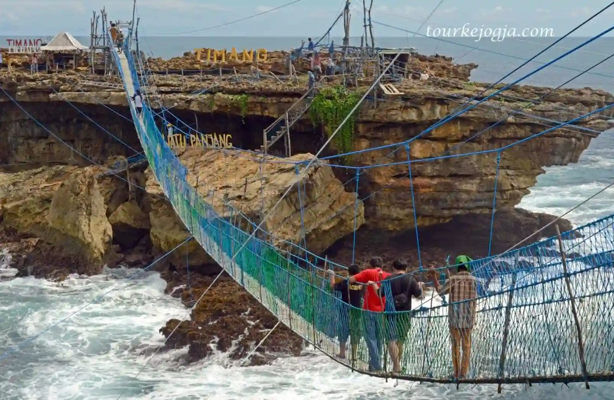
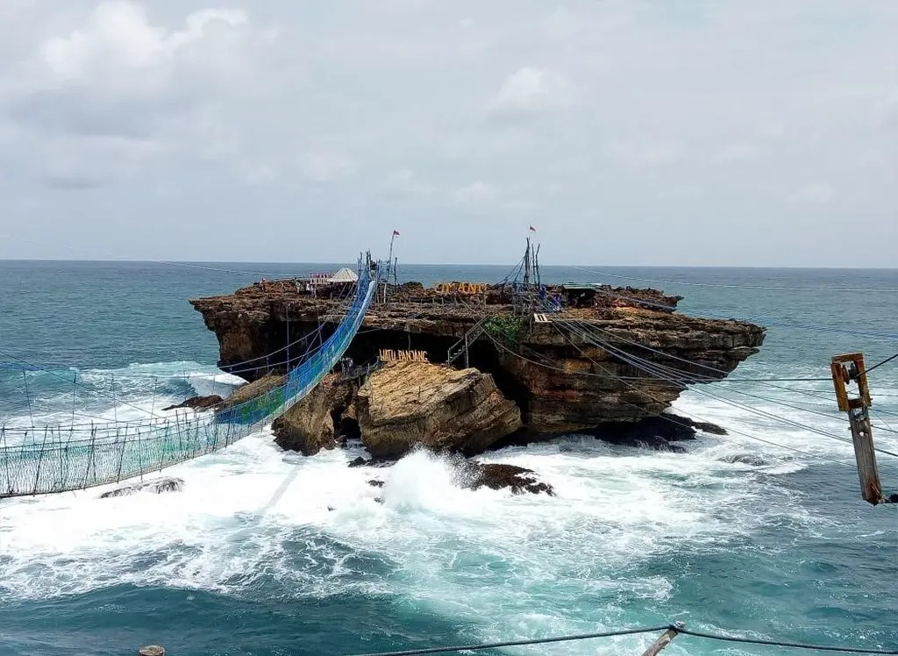
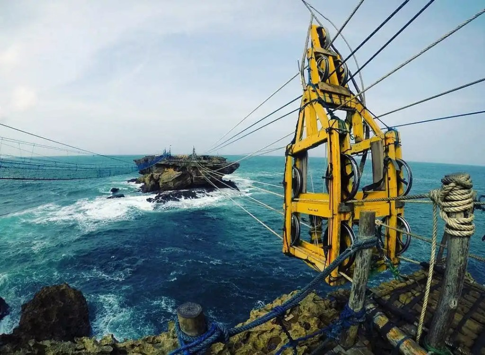
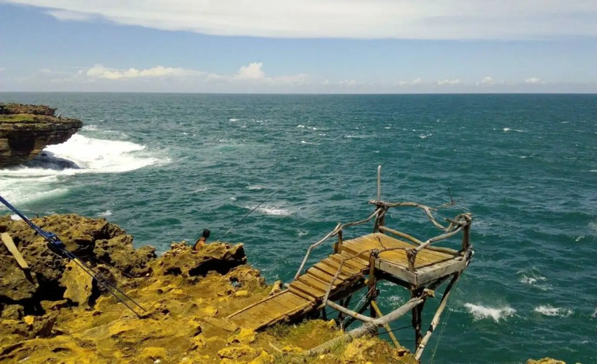

Pantai Timang adalah salah satu pantai yang terletak di Gunung Kidul, Yogyakarta. Kalau kamu adalah penggemar pantai dengan keindahan dan keunikannya, Pantai Timang adalah salah satu pantai yang wajib kamu kunjungi.

Bagaimana tidak? Perpaduan pesona alam alami dengan bantuan tangan manusia menjadi satu pemandangan yang sedap dipandang juga dinikmati. Selain itu, pengelola juga menyediakan berbagai fasilitas wisata yang bisa kamu nikmati sewaktu liburan.

Pada tulisan ini, kita akan membahas lokasi atau letak Pantai Timang, gondola, jembatan, dan persewaan jeep di Pantai Timang. Enggak nyesel deh kalau kamu liburan ke yang unik ini.

Lokasi atau Letak Pantai Timang
-------------------------------

Pantai Timang terletak di Desa Purwodadi, Kabupaten Gunung Kidul, Provinsi Daerah Istimewa Yogyakarta. Dari Kota Yogyakarta, kamu memerlukan waktu sekitar dua sampai dua setengah jam untuk mencapai Pantai Timang.

Lokasi Pantai Timang berada sekitar 75 kilometer dari Kota Yogyakarta. Meskipun untuk mencapai pantai ini memerlukan banyak waktu, tetapi bukan berarti menjadi penghalang bagi wisatawan mengunjungi pantai ini.

Kalau dibandingkan Pantai Wohkudu, Pantai Jungwok, Pantai Wediombo, dan lainnya, Pantai Timang masih terasa asing di telinga kita, bukan? Memang masih asing, tapi pemandangan yang ditawarkan akan memanggilmu kembali ke Pantai Timang.

### Jalan Menuju Pantai Timang

Oiya, terdapat tiga rute utama yang bisa kamu tempuh untuk mencapai Pantai Timang. Rute pertama adalah Jalan Imogiri atau Jalan Panggang.

Dari Jalan Imogiri Timur ke barat menuju Pasar Pleret. Kemudian ikuti jalan menuju Tanjakan Cinomati, ke arah barat lagi. Ikuti jalan, sampai Jalan Playen Dlingo. Masih ke barat sampai Pasar Mentel, Alfamart Tepus, hingga masuk di Jalan Pantai Selatan Jawa. Ikuti jalan sampai menemukan petunjuk jalan menuju Pantai Timang

Selain itu, kamu juga bisa lewat Jalan Wonosari dengan rute yang hampir mirip. Dari Jalan Piyungan ke arah barat, ikuti jalan. Sampai Patuk, ambil ke selatan. Ikuti jalan, melewatai Tahura Bunder, masih ke selatan. Ambil ke kanan di perempatan Gedung Serba Guna Siyono. Ikuti jalan sampai masuk di Jalan Pantai Selatan Jawa. Ikuti jalan sampai menemukan petunjuk jalan menuju Pantai Timang.

Untuk lebih memudahkan kamu, kamu bisa menggunakan peta dari Google Maps di bawah ini.

Harga Tiket Masuk Pantai Timang Gunung Kidul
--------------------------------------------

Sesampainya di parkiran, kamu harus membayar parkir dua ribu rupiah untuk sepeda motor, sedangkan mobil lima ribu rupiah. Untuk biaya retribusi, kamu cukup merogoh kocek sepuluh ribu rupiah per orang. Dengan biaya tak sampai 20 ribu rupiah, kamu bisa menikmati pemandangan Pantai Timang.

Wisata Pantai Timang Jogja
--------------------------

Rasanya kurang lengkap kalau sudah sampai di pantai ini, sekadar duduk-duduk di pinggir pantai. Kamu bisa mencoba beberapa wisata yang ada di sini. Seperti gondola, jembatan gantung, dan wisata jeep.

Yang menjadi catatan, semua wisata atau fasilitas tersebut tidak cuma-cuma, ya. Kamu harus siap-siap merogoh kocek untuk menikmati wisata yang ada.

### Jembatan Gantung Pantai Timang Jogja

Aku pikir, jembatan gantung semacam ini hanya ada di film-film laga yang tayang di bioskop. Nyatanya, di Pantai Timang kamu bisa menikmati serunya dan menegangkannya nmelewati jembatan gantung.

Jembatan yang menghubungkan dengan karang di tengah ini memiliki panjang sekitar 100 meter. Jembatan ini berada sekitar 9 meter di atas ombak yang menderu-deru. Membayangkannya saja sudah menegangkan.

https://www.alodiatour.com/jembatan-pantai-timang/

#### Harga Naik Jembatan Gantung Pantai Timang

Seperti yang kutulis sebelumnya, untuk menikmati fasilitas atau wisata ini, kamu harus merogoh kocek cukup dalam, Rp100.000 per orang. Dengan biaya segitu, kamu bisa menikmati sensasi menegangkannya berjalan di jembatan gantung yang benar-benar tampak hanya digantung.

### Gondola

Kalau wisata yang satu ini, rasa-rasanya lebih menegangkan, _sih_. Kenapa? Saat menaiki wisata ini, kamu hanya sendirian berdiri pada sepetak kotak yang terhubung dengan tali-tali.

Selanjutnya, petugas akan menarik salah satu talinya hingga kamu akan meluncur dan tiba di tengah karang yang menjulang. Dari ketinggian, kamu akan merasakan sensasi angin semilir, kotak yang bergoyang-goyang, sembari melihat ganasnya ombak yang seolah tak ada habisnya.

https://www.instagram.com/pantai\_timang/

#### Harga Naik Gondola Pantai Timang

Kalau ingin merasakan menyebrang laut dengan gondola di Pantai Timang, kamu harus merogoh kocek sebesar Rp150.000 per orang. Selisih 50 ribu rupiah dengan jembatan gantung. Hmm... Sedap, _hehehe_.

### Sewa Jeep sekaligus Guide

Di Pantai Timang Gunung Kidul, kamu juga bisa merasakan serunya membonceng jeep. Tak hanya memacu adrenalin, tapi kamu juga akan mendapatkan ilmu-ilmu yang kamu peroleh dari guide.

Tertarik dengan serunya mengendarai mobil jeep? Kamu harus mengeluarkan uang sebesar 350 ribu rupiah untuk menikmatinya. Kalau ini, bukan lagi lumayan mahal, bagi saya yang masih di bangku kuliah, itu mahal sekali, _heheheh_.

Harga-harga tersebut adalah harga yang bisa berubah sewaktu-waktu. Aku mengambil referensi harga dari situs pantaitimang.com.

### Spot Foto Ekstrem

Masih berkaitan dengan adrenalin. Di salah satu sisi Pantai Timang, terdapat satu spot foto yang bisa memicu adrenalin. Spot foto yang disiapkan berupa petak kotak kecil yang terletak di luar tebing.

https://travelspromo.com/htm-wisata/pantai-timang-yogyakarta/

Spot ini disangga dengan kayu-kayu yang disusun sedemikian rupa sehingga terkesan masih kuat. Namun, melihatnya saja kadang sudah membuat diri ini _deg-degan_.

Gimana? Udah punya gambaran mengenai Pantai Timang? Satu tips untuk berlibur ke Pantai Timang, bawalah uang cash dengan jumlah yang cukup. Kalau kamu ingin menjajal semua wahana, artinya kamu harus siap uang cash sekitar 500 ribu rupiah.

Kalau kamu pernah mengunjungi pantai ini, tinggalkan ulasanmu, ya.

Selamat berlibur!