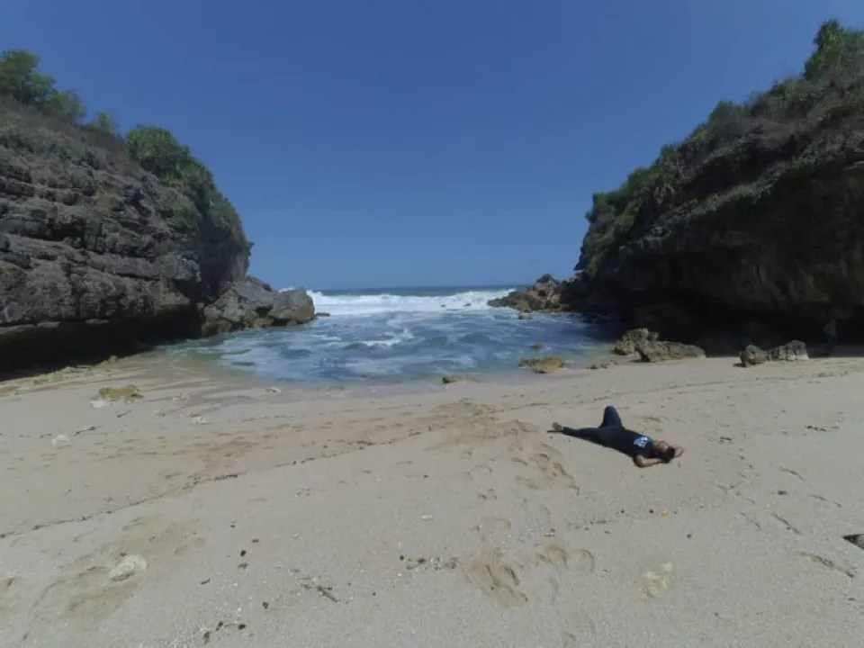

Pantai Torohudan adalah salah satu pantai yang terletak di Gunung Kidul, Yogyakarta. Ukuran pantai ini terbilang kecil dibandingkan pantai yang terletak di Gunung Kidul, Yogyakarta.

Tak perlu khawatir, untuk sampai ke bibir Pantai Torohudan Gunung Kidul, kamu cukup berjalan kaki dari parkiran. Berjalan sedikit, lalu menuruni beberapa anak tangga hingga akhirnya menyentuh bibir pantai.

Kalau Anda ingin mengunjungi deretan pantai sepi, tetapi tak perlu banyak perjuangan, Pantai Torohudan dapat Anda jadikan salah satu destinasi berlibur Anda.

Lokasi, Alamat, dan Rute Pantai Torohudan Gunung Kidul
------------------------------------------------------

Untuk sampai ke Pantai Torohudan di Jogja, tidak terlalu sulit karena tidak jauh dari Pantai Ngrenehan, persis di sebelah timur pantai. Anda dapat menempuh perjalanan dari Kota Yogyakarta menuju Desa Kanigoro di Kecamatan Yogja, Saptosari, Gunungkidul.

Rute menuju Pantai Torohudan sama dengan jalur menuju Pantai Ngrenehan. Anda bisa berkendara melalui Imogiri Bantul. Dari pusat Kota Jogjakarta, Anda juga dapat melalui kota Wonosari. Namun, saya lebih menyarankan melalui Jalan Imogiri Timur jika dari Kota Yogyakarta.

Setelah sampai di terminal Panggang, belok kiri menuju Saptosari. Selanjutnya, Anda akan menemukan rambu jalan ke pantai Ngrenehan, ikuti jalan sekitar 4 km sampai Anda mencapai Pantai Torohudan dan sekitarnya.

lagilibur.com

Tak perlu takut jika kesasar karena keramahan penduduk akan membantu Anda sampai ke pantai ini. Anda dapat memarkirkan kendaraan Anda di Tempat Parkir Pantai Ngrenehan.

Bicara mengenai akses jalan, jalannya relatif mulus. Jalanan aspal masih mendominasi. Bahkan, Anda dapat berkendara ke area parkir Ngrenehan dengan mudah. Meski demikian, pastikan kendaraan dan sopir dalam keadaan prima ya.

Harga Tiket Masuk dan Jam Operasional
-------------------------------------

Harga tiket ke pantai Torohudan tentunya sama dengan pantai Ngrenehan, Nguyahan, dan Ngobaran karena masih dalam satu kawasan. Anda hanya perlu membayar tiket masuk pantai sebesar Rp. 5.000 per orang untuk dapat mengakses deretan pantai Torohudan, antara lain pantai Ngrenehan dan Ngobaran.

Biaya parkir juga cukup murah yaitu Rp.2000 untuk motor dan Rp.5000 untuk mobil. Pantai Torohudan Gunungkidul buka setiap hari 24 jam.

https://jogjaonstage.com/

Fasilitas di Pantai Torohudan
-----------------------------

Kehadiran tanaman pandan laut yang tumbuh padat menciptakan kawasan pantai tersebut terkesan tersembunyi serta minim diketahui. Namun, kondisi ini sekaligus menjadi daya pikat tersendiri. Pemandangan ini dapat dipertahankan untuk memberikan kesan unik.

Pantai Torohudan memiliki garis pantai sekitar 50 meter. Artinya, pantai ini tampak lebih sempit dari Pantai Ngrawah atau pantai lain. Pantai ini diapit oleh dua tebing yang cukup tinggi yang juga cenderung masuk ke laut dan membentuk semenanjung. Penduduk setempat menyebutnya Semenanjung Torohudan atau hanya Tanjung.

https://www.lagilibur.com/

Pantainya cukup lembut dengan pasir putih yang tampak lebih besar. Meski demikian, pasirnya terasa halus di kulit. Bebatuan karang juga bisa terlihat di dasar laut, terutama saat ombak sedang tinggi. Warnanya kuning keemasan dan terlihat begitu indah.

Sebelum menginjakkan kaki di bibir pantai, terdapat warung makan di kanan-kiri tempat parkir. Anda dapat mengisi perut Anda di warung tersebut. Tak hanya itu, warung-warung tersebut juga menyediakan persewaan payung dan alas duduk.

Sebagai pengunjung yang hemat, saya menyarankan Anda untuk membawa bekal air mineral ataupun makanan ringan sampai berat. Namun, Anda juga bisa _melarisi_ penduduk lokal yang berjualan di tepi pantai.

Pantai Torohudan dengan lokasi lumayan tersembunyi mengakibatkan pantai ini menjadi kawasan favorit tuk _outdoors_ ataupun berkemah. Jika Anda orang-orang yg menyukai berpetualang, Anda dapat mengeksplore isi pantai Torohudan.

Gimana? Udah siap ke Pantai Torohudan? Bagikan pengalamanmu di kolom komentar juga ya! Selamat berlibur!