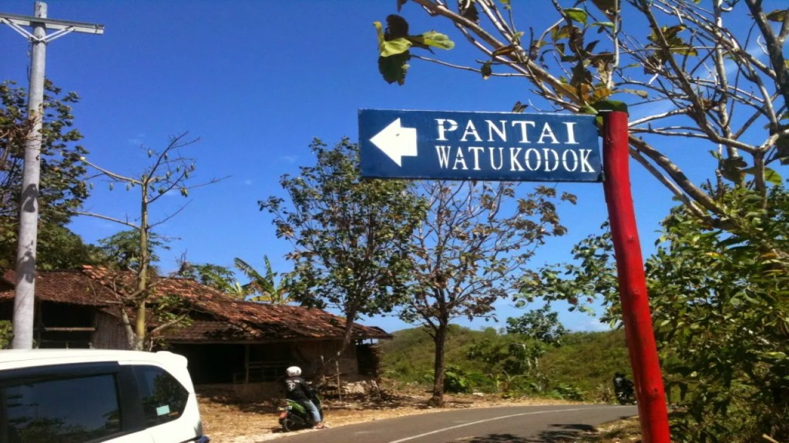
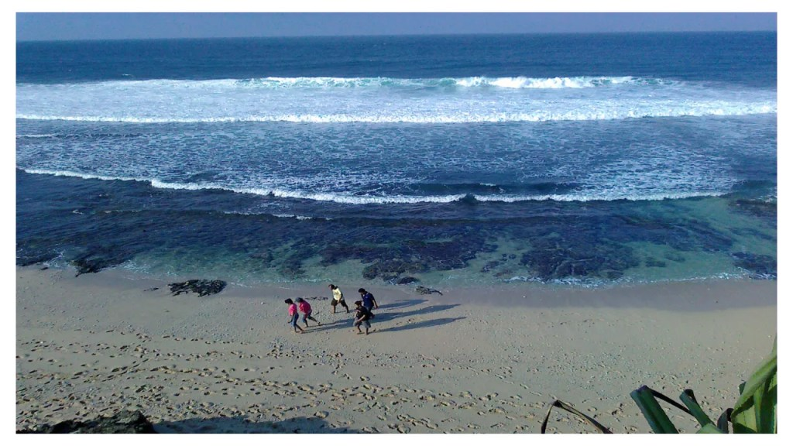
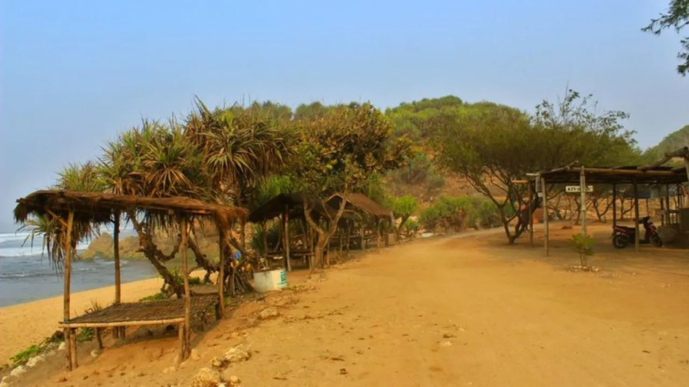
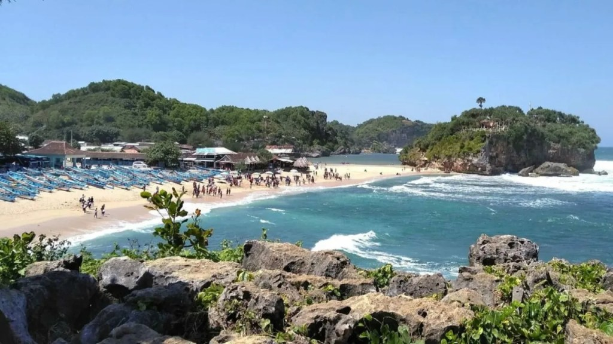

Pantai Watu Kodok ini merupakan pantai yang terletak di Gunung Kidul. Pantai Watu Kodok pasir putih dihiasi air laut bernuansa biru nan indah. Ada pula bebatuan serta karang terjal di pantai menawan ini.

Bebatuan nan indah tersebut menjadi salah satu keunikan dari Pantai Watu Kodok. Tak hanya itu, keindahan ini menjadi daya pikat bagi wisatawan lokal maupun mancanegara. Atmosfer pantai yang masih natural ini menjadi daya tarik khas Pantai Watu Kodok.

Walaupun pantai Watu Kodok dikategorikan pantai baru, pantai ini tidak dapat dilewatkan begitu saja. Kawasan wisata ini pas untuk liburan Anda kapanpun bersama siapapun.

Lokasi dan Rute Pantai Watu Kodok
---------------------------------

Tempat wisata ini dapat dikatakan sangat mudah untuk dijangkau. Pantai Watu Kodok terletak di deretan pantai yang terdapat di Gunung Kidul. Lebih tepatnya di Desa Kemadang, Kecamatan Tanjungsari, Kabupaten Gunungkidul, Daerah Istimewa Yogyakarta.

Rute menuju pantai ini lumayan mudah dilalui, tetapi tetap hati- hati sebab rute yang akan Anda lalui naik turun serta berkelok- kelok. Dari Kota Yogyakarta, pantai ini berjarak kurang lebih 70 kilometer. Kalau ditempuh menggunakan kendaraan pribadi, membutuhkan waktu waktu sekitar 2 jam dari Malioboro.

Rute yang sangat efisien mengarah pantai ini ialah dari arah jalan Kota Yogyakarta, kalian dapat mengarah ke arah Wonosari. Setelah itu Anda dapat mengikuti jalan ke arah Pantai Baron.

Selanjutnya, masuk ke retribusi Pantai Baron, kemudian belok ke kanan, mengarah ke arah Pantai Indrayanti. Dari sana tampak penunjuk arah yang mengarah ke Pantai Watu Kodok.

Harga Tiket Masuk Pantai Watu Kodok dan Jam Buka
------------------------------------------------

Harga tiket masuk ke wisata pantai ini lumayan terjangkau lho, bagi Anda yang mau berkunjung ke kawasan ini hanya perlu membayar Rp. 5000 per orang. Apabila Ada hendak bermalam atau _camping_ di kawasan ini, Anda harus membayar Rp 5.000– Rp 10.000 per orang.

Untuk biaya parkir, wisatawan cukup merogoh kocek Rp.3000 bagi kendaraan roda 2 serta Rp. 5000 untuk kendaraan roda 4.

### Jam Buka

Nah untuk Anda yang suka banget jalan-jalan kapan saja serta di mana saja, tak perlu takut deh. Sebab Anda dapat mendatangi pantai menawan ini kapan saja. Kawasan wisata pantai ini buka tiap hari. Pantai ini buka 24 jam.

Fasilitas dan Aktivitas yang bisa Dilakukan
-------------------------------------------

Dengan seluruh keelokan serta keistimewaan yang disuguhkan oleh pantai Watu Kodok Gunung Kidul, ada bermacam-macam sarana yang bisa dimanfaatkan oleh wisatawan. Simak penjelasannya berikut ini.

### Camping di Pantai Watu Kodok

Menjadi kenikmati sendiri jika bermalam di tepi laut yang dapat digunakan buat ber- camping ria, tepi laut ini sediakan zona yang lumayan luas buat kalian serta sahabat bermalam dengan mendirikan tenda di tepi laut.

Menikmati atmosfer malam yang pula menyatu dengan alam pastinya jadi momen yang tidak terlupakan selama hidup. Jangan takut dengan keamanan sepanjang bermalam di situ, sebab terdapat masyarakat yang bertugas buat melindungi keamanan wisatawan yang lagi camping di zona perkemahan.

### Zona Piknik dengan Gazebo

Untuk Anda yang mau istirahat sejenak sembari menikmati pesona tepi laut, Anda dapat menikmati sarana gazebo yang ada di pinggiran tepi laut. Bersantai sembari menikmati hembusan angin khas tepi laut pasti hendak menyegarkan benak sepanjang liburan.

### Mushola serta Toilet

Untuk wisatawan muslim, tak perlu khawatir sebab pengelola Pantai Watu Kodok menyediakan mushola serta WC. Kedua fasilitas ini dapat Anda manfaatkan demi kenyamanan wisatawan.

### Kedai Makanan

Pengalaman yang berkesan sepanjang mendatangi tepi laut, kurang lengkap rasanya jika belum mencicipi hidangan khas tepi laut. Jajanan khas tepi laut Watu Kodok dapat kalian nikmati di zona dekat tepi laut dengan menu santapan yang pastinya murah meriah.

Penginapan Murah di Pantai Watu Kodok
-------------------------------------

Tidak hanya informasi mengenai Pantai Watu Kodok, barangkali Anda juga memerlukan informasi mengenai hotel ataupun penginapan Pantai Watu Kodok.

Tenang saja, tidak hanya menginap di _area camping ground_, Anda dapat bermalam di penginapan ataupun hotel yang lokasinya lumayan dekat Pantai Watu Kodok.

Terdapat beberapa hotel yang kami rekomendasikan, seperti Sembodro Cottages, Sundak Indah Homestay, Hotel Kampoeng Drini, Hotel Kukup Indah, Gubuk Asmoro Nglolang, Homestay Alam Baru, Winahyu Family Resort, Greenhouse at Pantai Kukup.

Harga untuk menginap di Penginapan Pantai Watu Kodok pun bervariasi, mulai dari 100 ribu hingga 350 ribu tiap malamnya. Itu semua tergantung fasilitas yang ingin Anda nikmati.