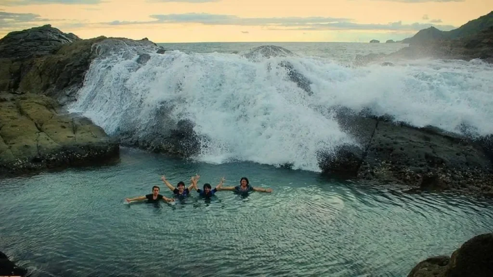

Pantai Wediombo adalah salah satu pantai yang ada di selatan Pulau Jawa. Dalam bahasa Jawa, _wedi_ berarti pasir, _ombo_ berarti luas. Dengan demikian, Pantai Wediombo memiliki arti harafiah pasir yang luas. Ya memang seperti itu adanya.

Meski ombak yang datang cukup besar, bukan menjadi alasan pantai ini menjadi sepi. Pantai ini menjadi salah satu pantai yang wajib dikunjungi ketika Anda sedang berlibur ke Yogyakarta.

Seperti namanya, bibir Pantai Wediombo ini terkesan lebih luas dibanding pantai-pantai yang ada di Kabupaten Gunung Kidul, Daerah Istimewa Yogyakarta. Dari kita berdiri, kita dapat menikmati pemandangan laut yang luas nan jernih dengan bukit hijau di kanan kirinya.

Lokasi dan Rute ke Pantai Wediombo
----------------------------------

Pantai berpasir putih ini terletak di Jepitu, Girisubo Kabupaten Gunung Kidul, Daerah Istimewa Yogyakarta. Kurang lebih 100 kilometer dari Kota Yogyakarta.

Anda dapat menempuh perjalanan sekitar 2,5 jam menggunakan kendaraan pribadi (motor ataupun mobil). Tenang saja, jalannya sudah cukup mulus. Meski begitu, pastikan sopir dan kendaraan Anda dalam kondisi prima ya.

Terdapat beberapa rute yang dapat Anda lalui untuk mencapai pantai ini. Salah satunya lewat Wonosari kota. Dari Jalan Piyungan, naik menuju Kota Wonosari. Kemudian pergi ke arah Desa Mulo. Selanjutnya, ke kiri arah Jepitu.

Dari daerah Jepitu, Anda akan menemukan petunjuk arah ke Pantai Wediombo. Jadi, Anda tak perlu khawatir mengenai petunjuk arah. Bagi saya, rute Wonosari adalah rute yang paling efisien dan efektif. Sembari menikmati pemandangan, Anda juga bisa mampir membeli oleh-oleh belalang goreng di tepi jalan.

Harga Tiket Masuk dan Jam Buka Pantai Wediombo
----------------------------------------------

Bicara harga tiket masuk, Anda tak perlu khawatir karena masih terjangkau. Jadi, Anda tak perlu merogoh kocek terlalu dalam untuk berwisata ke Pantai Wediombo.

Untuk menikmati keindahan Pantai Wediombo, Anda cukup merogoh kocek 5000 rupiah untuk biaya retribusi. Selanjutnya, 2000 rupiah untuk biaya parkir kendaraan roda dua (jika tidak menginap). Kalau menginap, biaya parkirnya menjadi 10ribu sampai 15ribu. Biaya parkir mobil sebesar 10ribu rupiah (jika tidak menginap). Kalau menginap sekitar 20ribu-35ribu rupiah.

bp-guide.id

Oiya, Anda bisa menghabiskan waktu liburan di pantai ini dengan nge-camp. Untuk nge-camp, Anda tak perlu merogoh kocek terlalu dalam. Cukup 35ribu rupiah per malam, Anda dapat ngecamp di Pantai Wediombo.

Kalau ditanya jam berapa pantai ini buka, dapat dikatakan setiap saat pantai Wediombo buka. Tidak ada hari tertentu untuk menutup kawasan wisata ini.

Artinya, pihak pengelola menerapkan jam operasional pantai ini 24 jam non stop. Wisatawan dapat keluar masuk pantai kapan saja. Sebagai catatan, bawalah penerangan secukupnya jika berkunjung pada malam hari. Sejauh mata memandang, masih minim penerangan.

Hal Menarik dan Fasilitas Pantai Wediombo
-----------------------------------------

Meski bentuk pantai yang ada di Gunung Kidul mirip-mirip, tetapi tetap saja memiliki keunikannya masing-masing. Termasuk Pantai Wediombo.

Pantai ini memiliki berbagai fasiltas ataupun obyek wisata yang menarik untuk dilihat dan dinikmati. Pantai yang terbilang masih asri ini juga bisa membuat nuansa romantis bagi Anda yang kemari bersama pasangan.

Bagi yang kemari tidak bersama pasangan, bukan menjadi masalha berarti. Bagaimanapun, pantai ini adalah pantai umum. Jadi, tidak ada syarat harus membawa pasangan ke pantai ini (malah _out of topic, hahaha_).

Berikut ini beberapa keunikan yang ada di Pantai Wediombo

### Laguna Wediombo, Kolam Renang Alami

Dari ramainya pengunjung, berjalanlah ke arah timur, di ujung Pantai Wediombo terdapat kolam renang alami dengan pemandangan yang sangat indah. Bagaimana tidak?

Kolam renang ini terbentuk secara alami, terpisah dari gempuran obak. Kolam ini dibatasi karang yang mampu memecah ombak yang datang.

piknikwisata.com

Meskipun terpisah ombak, kalau Anda berenang di kolam renang alami ini, Anda tetap harus berhati-hati. Pasalnya terdapat ombak yang datang tanpa permisi. Selain itu, karang yang ada cukup tajam, bisa melukai kaki Anda jika tidak berhati-hati.

Di sela-sela karang yang kokoh berdiri, terdapat beberapa "air terjun mini" alami pula. Air terjun mini ini ada karena adanya ombak yang lewat di sela-sela karang. Jernihnya air juga menambah kealamian kolam renang alami ini.

Jika Anda berkujung ke Wediombo, sempatkanlah menengok kolam renang alami ini. Jangan lupa abadikan momenmu agar kelak dapat mengenang masa-masa pernah ke pantai ini.

### Spot Asyik Menikmati Sunset maupun Sunrise

Karena memiliki bibir pantai yang sangat panjang, Anda dapat menikmati sunset maupun sunrise di setiap sisisnya. Namun, jika Anda sedikit kurang beruntung, mungkin sunset ataupun sunrise akan terhalang mendungnya awan.

pergiyuk.com

Paduan warna biru, putih, hijau, oranye menjadi pemandangan yang indah menghiasi laut lepas dan bibir pantai Wediombo. Menjadi hal yang sangat sayang dilewatkan begitu saja.

### Banyak Spot Foto yang Indah

Tak hanya panorama sunsetnya yang menakjubkan, Anda juga akan menemukan spot foto yang Instagramable hampir di setiap sisi pantai ini.

Berlatar belakang birunya air laut, tingginya gelombang, banyaknya karang menjadi paduan yang khas pantai selatan Pulau Jawa ini. Di sisi yang lain, Anda dapat berfoto di ayunan yang dibuat natural oleh pihak pengelola. Ayunan dengan gaya natural ini akan menambah ke-caem-an kenangan Anda.

### Spot Mancing dan Camping

Anda gemar memancing? Pantai Wediombo menjadi salah satu spot yang dapat Anda gunakan untuk menyalurkan hobi Anda. Anda dapat menancapkan pancing Anda di sisi-sisi Pantai Wediombo. Namun, jangan sampai mengganggu kebebasan orang lain ya.

Kalau Anda hendak memancing di pantai ini, Anda harus menyiapkan segala peralatannya secara pribadi. Di sekitaran Wediombo, tidak ada tempat penyewaan pancing.

Begitu juga bagi Anda yang gemar camping. Anda harus menyiapkan peralatan camping Anda. Berbeda dengan Pantai Slili maupun Sadranan yang ada persewaan alat camping, di pantai ini tidak ada persewaan alat camping.

### Persewaan Payung

Jangan khawatir kalau Anda tidak membawa alat untuk berteduh. Di sepanjang bibir pantai ini, terdapat persewaan payung pantai. Anda dapat menyewa satu payung pantai ini untuk rombongan Anda.

pantainesia.com

Kalau Anda tak ingin bermain air, Anda dapat duduk-duduk bersantai di bawah payung tersebut. (Mungkin) payung ini tidak dapat menutupi seluruh bawaan Anda, tetapi kalau untuk berlindung dari teriknya matahari, menyewa payung pantai bisa menjadi pilihan.

### Wisata Kuliner

Agar liburan Anda lebih terasa lengkap, siapkan bujet lebih banyak agar Anda dapat mencicipi masakan khas pantai. Beragam olahan seafood dapat Anda pesan di sekitar bibir pantai.

Namun, bagi Anda yang ingin mengirit pengeluaran ketika berwisata (seperti saya), Anda dapat membawa bekal pribadi. Dengan membawa bekal, tentu saja akan lebih menghemat pengeluaran ketika berada di obyek wisata.

Gimana? Udah makin mantap ingin berlibur ke pantai Wediombo? Anda dapat mengunjungi pantai ini kapanpun. Pastikan diri dan kendaraan Anda dalam keadaan prima, agar lebih nyaman ketika liburan.

Selamat berlibur!