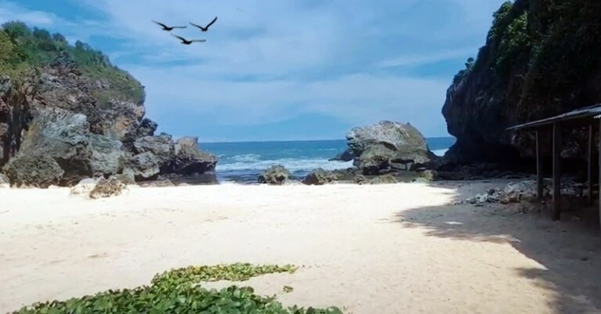
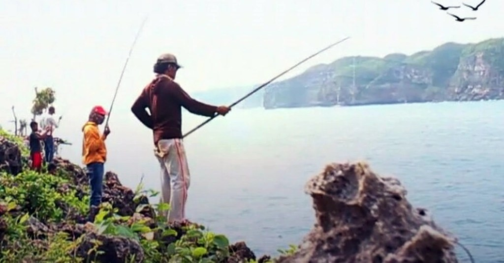
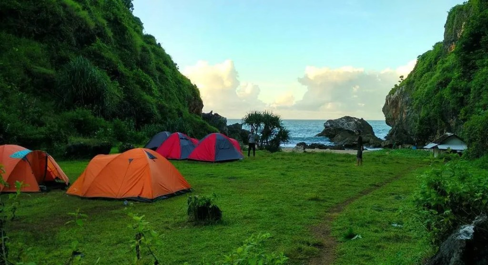

Pantai Wohkudu merupakan pantai terindah di salah satu wilayah Kabupaten Gunung Kidul. Pantai Jogja ini menawarkan keindahan alam dan kesegaran yang mampu meningkatkan _mood_ siapa pun yang berkunjung ke tempat ini.

Menjadi kota yang sering dijadikan tujuan wisata, tak heran Jogja selalu menawarkan berbagai tempat wisata yang menakjubkan. Pantai Wohkudu merupakan salah satu tempat wisata alam yang paling banyak dikunjungi oleh wisatawan lokal maupun mancanegara.

Sumber: [Kompasiana.com](http://kompasiana.com)

Nah, bagi kamu yang ingin berlibur ke Jogja, Pantai Wohkudu bisa jadi pilihan yang tepat, _lho_. Sebelum berwisata ke tempat pantai ini, simak ulasan lengkap berikut ini.

Lokasi, Alamat, dan Rute Pantai Wohkudu
---------------------------------------

Pantai Wohkudu terletak di Dukuh Wiroso, Girikarto, Panggang Kabupaten Gunung Kidul. Pantai ini terletak sekitar 40 kilometer dari Kota Yogyakarta. Jika kamu menggunakan kendaraan pribadi seperti motor atau mobil, kamu memerlukan waktu sekitar satu setengah hingga dua jam perjalanan dengan asumsi jalanan tidak macet.

Seperti pantai yang pernah saya ulas sebelumnya, terdapat dua rute yang bisa kamu lewati untuk sampai ke Pantai Wohkudu. Rute pertama adalah Jalan Wonosari.

Dari Kota Yogyakarta, menuju Jalan Wonosari ke barat sampai di Pasar Playen. Selanjutnya menuju ke selatan sampai di Alfamart Paliyan. Lalu ke arah timur, di perempatan Heha Ocean View ambil jalan ke selatan. Ikuti jalan saja, kamu akan sampai di Pantai Wohkudu.

Rute kedua adalah Jalan Panggang. Rute yang bisa kamu ambil jika memilih Jalan Panggang sebagai berikut. Dari Jalan Imogiri Timur, naik menuju Jalan Panggang, sampai Perempatan Legundi. Selanjutnya, ambil ke selatan ikuti jalan hingga sampai di Pantai Wohkudu.

Dari kedua rute tersebut, saya lebih menyarankan untuk melewati Jalan Panggang atau Jalan Imogiri Timur. Selain perjalanannya tidak harus _ngalang_ atau berputar, tentu saja perjalanan yang kamu tempuh akan terasa lebih cepat.

### Lokasi Pantai Wohkudu

Untuk informasi lebih lengkap mengenai lokasi, alamat, dan rute yang bisa kamu tempuh, lihat Google Maps berikut ini.

Harga Tiket Masuk dan Jam Operasional
-------------------------------------

Terakhir kali saya ke Pantai Wohkudu, saya tidak dikenakan biaya masuk karena tidak ada yang jaga di pos penjagaan. Meski demikian, ada beberapa blog yang memberi informasi terdapat retribusi yang harus dibayar di desa terakhir sebelum kawasan pantai ini. Selain itu, kamu juga perlu membayar parkir ya.

Kamu harus membayar retribusi sebesar 3000 rupiah untuk motor dan 5000 rupiah untuk mobil. Sama halnya dengan retribusi, biaya parkir di Pantai Wohkudu juga 3000 rupiah untuk motor dan 5000 rupiah untuk mobil. Dengan membayar retribusi dan tempat parkir, harapannya pantai ini juga akan semakin tumbuh dan berkembang menjadi lebih baik lagi.

Fasilitas dan Hal Menarik
-------------------------

Di Pantai Wohkudu, terdapat beragam fasilitas dan hal-hal yang menarik yang bisa kamu lakukan. Berikut ini hal-hal yang bisa kamu nikmati ketika mengunjungi pantai tersebut.

### Spot Asyik untuk Memancing

Bagi kamu yang gemar memancing, kamu bisa membawa peralatan memancingmu karena di sini terdapat banyak sekali spot memancing. Kamu bisa memancing dari tepi pantai atau memancing dari tepi tebing.

Untuk ke tepi tebing tersebut, kamu harus berjalan menyusuri jalan setapak terlebih dahulu ya. Jika ingin memancing, pastikan kamu membawa peralatan mancing, serta baju ganti agar tetap merasa nyaman.

sumber: Jogjakita.co.id

### Camping Nyaman di Tepi Pantai Wohkudu

Tak puas hanya sehari berdinamika di alam? Kamu bisa mendirikan tenda atau nge-camp di tepi Pantai Wohkudu. Kamu tak perlu takut terkena ombak karena tempat nge-camp ini jaraknya lumayan jauh dari bibir pantai.

Sumber: ksmtour.com

Keunikan dari tempat nge-camp ini selain tempatnya terbilang bersih dan membuat nyaman, tempat ini didominasi warna hijau yang membuat mata semakin nyaman. Warna hijau ini berasal dari tumbuhan yang ada di pasir dan juga warna tebing yang mengapitnya. Oiya, karena diapit oleh dua bukit, pantai ini semakin menjadi _private beach_ yang bisa kamu nikmati bersama teman-temanmu.

### Tempat Tepat Nonton Sunset

Bagi yang gemar menikmati indahnya sunset, Pantai Wohkudu akan menawarkan pemandangan sunset yang luar biasa. Siluet dua bukit yang mengapit pantai ini, warna langit yang awalnya biru, perlahan jingga, ungu hingga gelap menyelimuti bisa kamu nikmati ketika cuaca juga mendukung.

Momen-momen seperti inilah yang bisa kamu manfaatkan sebagai latar belakang fotomu dengan orang tersayangmu. Kalau tak gemar berfoto, cukup duduk manis untuk menikmati penguasa siang beristirahat ke tempatnya.

### Akomodasi atau Fasilitas Umum

Selain keunikan-keunikan tersebut, tentu saja kita akan membahas akomodasi atau fasilitas umum yang ada di sana. Awal mula saya kemari, belum ada fasilitas yang cukup memadai. Untuk sebatas kamar mandi saja belum ada.

Namun, itu dulu, kini fasilitas yang disediakan sudah cukup lengkap. Terdapat kamar mandi, warung yang menjual makanan kecil hingga makanan berat, hingga mushola. Fasilitas tersebut dapat kamu nikmati ketika berkunjung ke pantai ini.

Hebatnya lagi, warung-warung yang ada di sekitar tempat nge-camp menyediakan kayu bakar yang bisa kamu gunakan untuk api unggun pada malam harinya. Namun, sayangnya stok kayu bakar itu tidak selalu ada. Mungkin karena digunakan juga oleh penjualnya. Berharap saja semoga kamu beruntung sehingga tak perlu repot-repot untuk mencari bahkan membawa kayu bakar sendiri.

Sayangnya, bagi kamu penggemar main air di pantai, Pantai Wohkudu menjadi pilihan yang kurang tepat karena terdapat banyak batu karang yang lancip. Selain itu, sebagain besar pantai ini diisi batu karang, bukan pasir pantai putih. Hal ini berbeda dari [Pantai Slili](https://www.infopantai.com/pantai-slili/) maupun [Pantai Sadranan](https://www.infopantai.com/pantai-sadranan/).

Kalaupun tetap ingin bermain di pantai ini, kamu harus menggunakan alas kaki. Penggunaan alas kaki ini dapat meminimalisir kakimu lecet terkena ganasnya batu karang.

Gimana? Sudah punya gambaran mengenai Pantai Wohkudu Gunung Kidul Yogyakarta? Jika kamu masih memiliki pertanyaan atau usulan tempat yang akan diulas, bagikan di kolom komentar ya!

Selamat liburan!